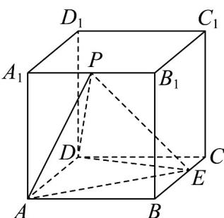

<!-- question-source:start -->
6. 如图，在正方体 $ABCD - A_{1}B_{1}C_{1}D_{1}$ 中， $E$ 为棱 $BC$ 上一点且 $BE = 2EC$ ，点 $P$ 是棱 $A_{1}B_{1}$ 上的动点，给出下

面4个结论：

①存在点 $P$ ，使 $PA \perp DE$ ；

②存在点 $P$ ，使 $PD = PE$ ；

③ $\triangle PDE$ 的面积不变；

④三棱锥 A-PDE 的体积不变.

则正确的结论的个数是（ ）A.1 B.2 C.3 D.4
<!-- question-source:end -->

![[高中/课堂同步/题库/人教A版高中数学同步讲义(2026)/03_选择性必修第一册/第一章 空间向量与立体几何/第一章 空间向量与立体几何（高效培优单元测试·提升卷）/一_选择题/questions/answers/Q00079949A1.md]]
