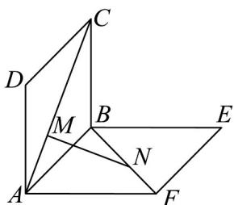

<!-- question-source:start -->
7. 如图所示，正方形 $ABCD$ ， $ABEF$ 的边长都是 1，且它们所在的平面互相垂直。动点 $M$ ， $N$ 分别在正方

形对角线 $AC$ 和 $BF$ 上移动，且 $CM = BN$ 。当 $MN$ 的长最小时，二面角 $A - MN - B$ 的平面角的余弦值为

( )

A. $-\frac{1}{3}$ B. $\frac{1}{3}$ C. $\frac{\sqrt{2}}{2}$ D. $-\frac{\sqrt{2}}{2}$
<!-- question-source:end -->

![[高中/课堂同步/题库/人教A版高中数学同步讲义(2026)/03_选择性必修第一册/第一章 空间向量与立体几何/第一章 空间向量与立体几何（高效培优单元测试·提升卷）/一_选择题/questions/answers/Q00079950A1.md]]
