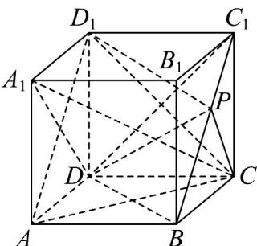
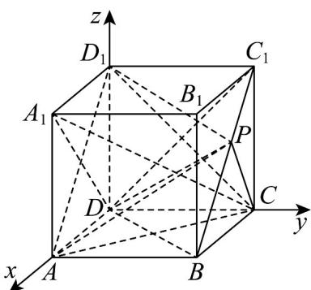

> [!faq]- 《第一章 空间向量与立体几何（高效培优单元测试·提升卷）》官方解析
>
> > [!success]- **【答案】** A
>
> > [!note]- **【分析】**
> > 由空间向量线性运算，可得 $AC_{1}=AB+AD+AA_{1}$ ，利用数量积运算性质即可得出。
>
> > [!note]- **【解析】**
> > ∵ $AC_{1}=AC+CC_{1}=AB+AD+AA_{1}$ 又 AB=1, AD=1, $AA_{1}=2$ , $\angle BAD=\angle BAA_{1}=\angle DAA_{1}=60^{\circ}$ , $\therefore AC^{2}=AB^{2}+AD^{2}+AA_{1}^{2}+2\left(AB\cdot AD+AB\cdot AA_{1}+AD\cdot AA_{1}\right)$ $=1^{2}+1^{2}+2^{2}+2\times\left(1\times1\times\frac{1}{2}+1\times2\times\frac{1}{2}+1\times2\times\frac{1}{2}\right)=11$ $\therefore\left|AC_{1}\right|=\sqrt{11}$
> >
> > 故选：A
> >
> > 2. 正方体 $ABCD - A_{1}B_{1}C_{1}D_{1}$ 中，点 $P$ 为线段 $BC_{1}$ 上的动点，则下列结论正确的是（）A. $A_{1}C \perp DP$
> >
> > B．三棱锥 $A-D_{1}PC$ 的体积为定值
> > C．直线 AP 与平面 $ACD_{1}$ 所成角的取值范围为 $\left[\frac{\pi}{6},\frac{\pi}{3}\right]$ D．直线 AP 与直线 $A_{1}D$ 所成的角为定值
> >
> > 【答案】ABD
> >
> > 【分析】对于 A，先由线线垂直证 $DC_{1} \perp$ 平面 $A_{1}CD_{1}$ ，得到 $DC_{1} \perp A_{1}C$ ，同理证得 $DB \perp A_{1}C$ ，从而得
> >
> > $A_{1}C \perp$ 平面 $DBC_{1}$ ，即可证 $A_{1}C \perp DP$ ；对于 $B$ ，由 $BC_{1} //$ 平面 $ACD_{1}$ 得到点 $P$ 到平面 $ACD_{1}$ 的距离不变，结
> >
> > 合底面 $\triangle ACD_{1}$ 面积为定值即得；对于 C，D，通过建系利用空间向量夹角公式，分别计算线面所成角和异面
> >
> > 直线所成角推理即得结论·
> >
> > 【详解】
> >
> > 
> >
> > 对于 $\mathsf{A}$ ，在正方体 $ABCD - A_{1}B_{1}C_{1}D_{1}$ 中， $A_{1}D_{1}\perp$ 平面 $DCC_{1}D_{1}$ ， $DC_1\subset$ 平面 $DCC_{1}D_{1}$ ，则 $A_{1}D_{1}\perp DC_{1}$
> >
> > 因 $DC_{1} \perp D_{1}C$ ， $A_{1}D_{1} \cap D_{1}C = D_{1}, A_{1}D_{1}, D_{1}C \subset$ 平面 $A_{1}CD_{1}$ ，故 $DC_{1} \perp$ 平面 $A_{1}CD_{1}$
> >
> > 因 $A_{1}C \subset$ 平面 $A_{1}CD_{1}$ ，故 $DC_{1} \perp A_{1}C$ ，同理可得 $DB \perp A_{1}C$
> >
> > 因 $DB \cap DC_{1} = D, DB, DC_{1} \subset$ 平面 $DBC_{1}$ ，则 $A_{1}C \perp$ 平面 $DBC_{1}$
> >
> > 又点 $P$ 为线段 $BC_{1}$ 上的动点，即 $DP \subset$ 平面 $DBC_{1}$ ，故 $A_{1}C \perp DP$ ，故 $\mathsf{A}$ 正确；
> >
> > 对于 B，易证 $BC_{1} // AD_{1}$ ，因 $BC_{1} \notin$ 平面 $ACD_{1}$ ， $AD_{1} \subset$ 平面 $ACD_{1}$ ，故 $BC_{1} //$ 平面 $ACD_{1}$ ，
> >
> > 则点 P 到平面 $ACD_{1}$ 的距离不变，又 $\triangle ACD_{1}$ 的面积为定值，故三棱锥 $A-D_{1}PC$ 的体积为定值，故 B 正确；
> >
> > 
> >
> > 对于 C，如图建立空间直角坐标系 D-xyz，设正方体的棱长为 1，则
> >
> > $$
> > A (1, 0, 0), C (0, 1, 0), D _ {1} (0, 0, 1), B (1, 1, 0), C _ {1} (0, 1, 1)
> > $$
> >
> > 因点 P 为线段 $BC_{1}$ 上的动点，设 $\overline{BP}=t\overline{BC}_{1}=(-t,0,t)$ ， $0\leq t\leq1$ ，则
> >
> > $$
> > A P = A B + B P = (0, 1, 0) + (- t, 0, t) = (- t, 1, t)
> > $$
> >
> > 因 $AD_{1}=(-1,0,1)$ , AC=(-1,1,0)，设平面 $ACD_{1}$ 的法向量为 $n=(x,y,z)$
> >
> > 则 $\left\{ \begin{array}{l} A D_{1} \cdot n = -x + z = 0 \\ A C \cdot n = -x + y = 0 \end{array} \right.$ ，故可取 $n = (1,1,1)$ ，
> >
> > 设直线 $AP$ 与平面 $ACD_{1}$ 所成角为 $\theta$ ，则 $\sin \theta = |\cos \langle AP, n\rangle| = \frac{| - t + 1 + t|}{\sqrt{3} \cdot \sqrt{2t^2 + 1}} = \frac{\sqrt{3}}{3} \times \frac{1}{\sqrt{2t^2 + 1}}$ ，
> >
> > 因 $y = \frac{1}{\sqrt{2t^2 + 1}}$ 在 $t \in [0,1]$ 上单调递减，故 $\frac{\sqrt{3}}{3} \leq \frac{1}{\sqrt{2t^2 + 1}} \leq 1$ ，故得 $\sin \theta \in [\frac{1}{3}, \frac{\sqrt{3}}{3}]$ ，故 $C$ 错误；
> >
> > 对于 D，根据 C 项建系，可得 $\overline{AP} = (-t, 1, t), \overline{A_{1}D} = (-1, 0, -1)$ ，设直线 AP 与直线 $A_{1}D$ 所成的角为 $\alpha$ ，
> >
> > 则 $\cos\alpha=|\cos\langle AP,A_{1}D\rangle|=\frac{|t+0-t|}{\sqrt{2}\cdot\sqrt{2t^{2}+1}}=0$ ，即 $AP\perp A_{1}D$ ，故 D 正确·
> >
> > 故选 **ABD**.
