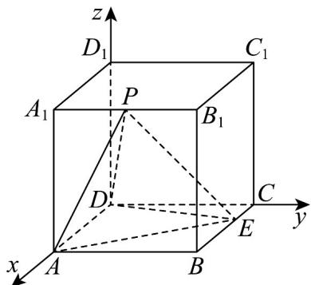

> [!faq]- 《第一章 空间向量与立体几何（高效培优单元测试·提升卷）》官方解析
>
> > [!success]- **【答案】** C
>
> > [!note]- **【分析】**
> > 建立适当的空间直角坐标系，对于 $^{A}$ ，只需验算 $AP \cdot DE = 0$ 是否成立，对于 $^{B}$ ，只需验算 $\left|PD\right|=\left|PE\right|$ 是否成立，对于 $^{C}$ ，∵DE为定值，故只需判断点P运动时到DE距离d是否是定值即可；对于
> > D，由P到底面距离h不变， $\triangle AED$ 面积 $S_{0}$ 不变即可判断.
>
> > [!note]- **【解析】**
> > 不妨以D为原点， $\overline{DA}$ 、 $\overline{DC}$ 、 $\overline{DD_{1}}$ 分别为x、y、z轴正方向建立直角坐标系D-xyz
> >
> > 
> >
> > 设 $AD = 3$ ，则 $A(3,0,0)$ ， $D(0,0,0)$ ， $E(1,3,0)$ ，设 $P(3,y,3)$
> >
> > 结论 ①： $AP = (0, y, 3)$ ， $DE = (1, 3, 0)$ ，令 $AP \cdot DE = 0$ 得 $3y = 0 \Rightarrow y = 0$ ，故当 P 与 $A_{1}$ 重合时， $PA \perp DE$
> > - **①**：正确；
> >
> > 结论②： $PD = \sqrt{9 + y^2 + 9}$ ， $PE = \sqrt{4 + (y - 3)^2 + 9}$ ，令 $PD = PE\Rightarrow y = \frac{2}{3}$ ，故当 $P\left(3,\frac{2}{3},3\right)$ 时， $PD = PE$
> > - **②**：正确；
> >
> > 结论 ③：∵ $A_{1}B_{1}$ 与 DE 不平行，故点 P 运动时到 DE 距离 d 不是定值，又∵ DE 为定值，故 $\triangle PDE$ 的面积
> >
> > $S=\frac{1}{2}DE\cdot d$ 不是定值．③错误．
> >
> > 结论④： $P$ 到底面距离 $h$ 不变， $\triangle AED$ 面积 $S_0$ 不变，而 $V_{A - PDE} = V_{P - ADE} = \frac{1}{3} S_0\cdot h$ 为定值．④正确.
> >
> > 故选 **C**.
