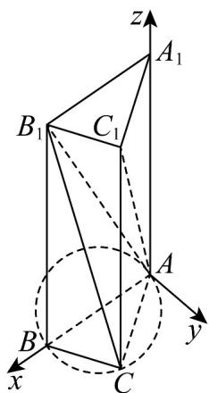

> [!faq]- 《第一章 空间向量与立体几何（高效培优单元测试·提升卷）》官方解析
>
> > [!success]- **【答案】** A
>
> > [!note]- **【分析】**
> > 如图建立空间直角坐标系，根据 $AC_{1} \cdot CB_{1} = 4$ 可得 $C$ 在底面的轨迹，再分割三棱柱可得
> >
> > $V_{C-AB_{1}C_{1}}=\frac{2}{3}S_{ABC}$ ，求 $S_{ABC}$ 的最大值即点C到底AB距离最大即 $|y|$ 最大时即可得解.
>
> > [!note]- **【解析】**
> > 如图，以 A 为坐标原点，以直线 AB 、在平面 $\vee ABC$ 内垂直于 AB 的直线、直线 $AA_{1}$ 所在方向分别
> >
> > 为 $x, y, z$ 正半轴·
> >
> > 
> >
> > $$
> > C (x, y, 0), A (0, 0, 0), B (2, 0, 0), A _ {1} (0, 0, 2), B _ {1} (2, 0, 2), C _ {1} (x, y, 2)
> > $$
> >
> > $\overline{AC_{1}}=\left(x,y,2\right),\overline{CB_{1}}=\left(2-x,-y,2\right)$ ， $AC_{1}\cdot CB_{1}=2x-x^{2}-y^{2}+4=4$ ，得 $x^{2}+y^{2}-2x=0$ ，即 $(x-1)^{2}+y^{2}=1$ ·即
> >
> > 点 $C$ 在底面的轨迹是以 $(1,0)$ 为圆心，半径为1的圆·
> >
> > $$
> > V _ {C - A B _ {1} C _ {1}} = V _ {A B C - A _ {1} B _ {1} C _ {1}} - V _ {B _ {1} - A B C} - V _ {A - A _ {1} B _ {1} C _ {1}} = S _ {A B C} \times 2 - \frac {1}{3} S _ {A B C} \times 2 - \frac {1}{3} S _ {A _ {1} B _ {1} C _ {1}} \times 2
> > $$
> >
> > 又因为 $S_{A_1B_1C_1} = S_{ABC}$ $V_{C - AB_1C_1} = \frac{2}{3} S_{ABC} = \frac{2}{3}\times \frac{1}{2}\big|AB\big|\big|y\big| = \frac{2}{3}\big|y\big|$
> >
> > 当 $|y|$ 取最大1时， $V_{C-AB_{1}C_{1}}$ 有最大值 $V_{C-AB_{1}C_{1}}=\frac{2}{3}$ .
> >
> > 故选：A.
> >
> > 二、选择题：本题共3小题，每小题6分，共18分．在每小题给出的选项中，有多项符合题目要求．全部选对的得6分，部分选对的得部分分，有选错的得0分.
