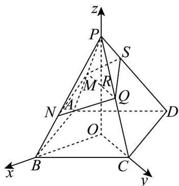

> [!faq]- 《第一章 空间向量与立体几何（高效培优单元测试·提升卷）》官方解析
>
> > [!success]- **【答案】** BCD
>
> > [!note]- **【分析】**
> > A 利用 $a = \lambda b$ 求解；B 数量积的坐标运算；C 求模公式；D 根据 $c = \lambda a + \mu b$ 求解 $\lambda, \mu \cdot$
>
> > [!note]- **【解析】**
> > 若 $a / / b$ ，则存在 $\lambda \in \mathbb{R}$ 使得 $a = \lambda b$ ，即 $2 = \lambda, 2 = -\lambda, 2 = \lambda$ ，无解，故A错误；
> >
> > $a \cdot b = 2 - 2 + 2 = 2$ ，故 B 正确；
> >
> > $\left|a\right| = \sqrt{4 + 4 + 4} = 2\sqrt{3}$ ，故C正确；
> >
> > 由 $^{A}$ 可知a与b可构成一组基底，故若a，b，c是共面向量，
> >
> > 则存在 $\lambda,\mu\in R$ 使得 $c=\lambda a+\mu b=\lambda(2,2,2)+\mu(1,-1,1)=(2\lambda+\mu,2\lambda-\mu,2\lambda+\mu)$
> >
> > 即 $2\lambda + \mu = 1, 2\lambda - \mu = 7$ ，解得 $\lambda = 2, \mu - 3$ ，故 $a$ ， $b$ ， $c$ 是共面向量，D 正确。
> >
> > 故选：BCD
> >
> > 11．正四棱锥 P-ABCD 中，各棱长均为 1， $\frac{PM}{2}=\frac{1}{2}PA,\quad\frac{PN}{3}=\frac{2}{3}PB,\quad\frac{UU}{PQ}=\frac{1}{2}PC$ ．过点 M，N，Q 的
> >
> > 平面交 $PD$ 于点S，且 $\overline{PS} = \lambda \overline{PD}$ ，则（）
> >
> > A. $\lambda = \frac{1}{3}$
> >
> > B．点S到平面PMQ的距离为 $\frac{\sqrt{2}}{5}$
> >
> > C. 平面 $MNQ$ 与平面 $ABCD$ 夹角的余弦值为 $\frac{4\sqrt{17}}{17}$
> >
> > D．两个四棱锥 P-MNQS 与 P-ABCD 体积之比为 2:15
> >
> > 【答案】BCD
> >
> > 【分析】对于 $^{A}$ ：建系，求平面 $^{MNQS}$ 的法向量，利用空间向量处理四点共面问题；对于 $^{B}$ ：可得
> >
> > $\vec{PS} = (-\frac{\sqrt{2}}{5}, 0, -\frac{\sqrt{2}}{5})$ ，且平面 $PMQ$ 的法向量 $\vec{m} = (1, 0, 0)$ ，结合点到面的距离公式运算求解；对于 $C$ ：利用
> >
> > 空间向量求面面夹角；对于 $^{D}$ ：利用转换顶点法结合锥体的体积公式运算求解。
> >
> > 【详解】对于选项 A：设底面 ABCD 的中心为 O，
> >
> > 以 $O$ 为坐标原点， $OB, OC, OP$ 分别为坐标轴，建立如图所示的空间直角坐标系，
> >
> > 
> >
> > 则 $A(0, -\frac{\sqrt{2}}{2}, 0), B(\frac{\sqrt{2}}{2}, 0, 0), C(0, \frac{\sqrt{2}}{2}, 0), D(-\frac{\sqrt{2}}{2}, 0, 0), P(0, 0, \frac{\sqrt{2}}{2})$
> >
> > 可得 $\overrightarrow{PA} = (0, -\frac{\sqrt{2}}{2}, -\frac{\sqrt{2}}{2}), \overrightarrow{PB} = (\frac{\sqrt{2}}{2}, 0, -\frac{\sqrt{2}}{2}), \overrightarrow{PD} = (-\frac{\sqrt{2}}{2}, 0, -\frac{\sqrt{2}}{2}), \overrightarrow{AC} = (0, \sqrt{2}, 0)$
> >
> > 又因为 $\frac{PM}{2}=\frac{1}{2}PA,\quad PN=\frac{2}{3}PB,\quad PQ=\frac{1}{2}PC,$
> >
> > 则 $\overrightarrow{NM} = \overrightarrow{PM} -\overrightarrow{PN} = \frac{1}{2}\overrightarrow{PA} -\frac{2}{3}\overrightarrow{PB} = (-\frac{\sqrt{2}}{3}, - \frac{\sqrt{2}}{4},\frac{\sqrt{2}}{12})$ $MUQ = \frac{1}{2} UA C = (0,\frac{\sqrt{2}}{2},0)$
> >
> > 设平面 MNQS 的法向量为 $n = (x, y, z)$ ，
> >
> > $$
> > \left\{ \begin{array}{l} \vec {n} \cdot N M = - \frac {\sqrt {2}}{3} x - \frac {\sqrt {2}}{4} y + \frac {\sqrt {2}}{1 2} z = 0 \end{array} \right.
> > $$
> >
> > 则 $\left\{\begin{aligned}\vec{n}\cdot MQ&=\frac{\sqrt{2}}{2}y=0\end{aligned}\right.$ ，令 $x=1$ ，则 $y=0, z=4$ ，
> >
> > 所以平面 MNQ 的一个法向量为 $n = (1, 0, 4)$ ,
> >
> > 因为 $\overrightarrow{MS} = \overrightarrow{PS} - \overrightarrow{PM} = \lambda \overrightarrow{PD} - \frac{1}{2} \overrightarrow{PA} = (-\frac{\sqrt{2}}{2} \lambda, \frac{\sqrt{2}}{4}, -\frac{\sqrt{2}}{2} \lambda + \frac{\sqrt{2}}{4})$
> >
> > 因为四点 $M, N, Q, S$ 共面，则 $\vec{n} \perp \vec{MS}$ ，可得 $\vec{n} \cdot \vec{MS} = -\frac{\sqrt{2}}{2} \lambda + 4 \left(-\frac{\sqrt{2}}{2} \lambda + \frac{\sqrt{2}}{4}\right) = 0$ ，解得 $\lambda = \frac{2}{5}$ ，故 A 错误；
> >
> > 对于选项 B：可得 $\overrightarrow{PS}=\frac{2}{5}\overrightarrow{PD}=(-\frac{\sqrt{2}}{5},0,-\frac{\sqrt{2}}{5})$
> >
> > 且平面 PMQ 的法向量为 $m = (1, 0, 0)$
> >
> > 所以点 $S$ 到平面 $PMQ$ 的距离为 $\frac{\left|m\cdot PS\right|}{\left|m\right|} = \frac{\sqrt{2}}{5}$ ，故B正确；
> >
> > 对于选项 C：显然平面 ABCD 的法向量为 $p = (0, 0, 1)$
> >
> > 且 $\cos p, n = \frac{p \cdot n}{|p| \cdot |n|} = \frac{4}{\sqrt{17}} = \frac{4\sqrt{17}}{17}$
> >
> > 所以平面 MNQ 与平面 ABCD 夹角的余弦值为 $\overline{17}$ ，故 C 正确；
> >
> > $$
> > \frac {4 \sqrt {1 7}}{1 7}
> > $$
> >
> > 对于选项 D：设点 S、D 到平面 PAB 的距离分别 $h_{1}, h_{2}$
> >
> > 则 $\frac{h_{1}}{h_{2}}=\frac{PS}{PD}$
> >
> > 因为 $\frac{V_{P-MNQS}}{V_{P-ABCD}}=\frac{2V_{P-MNS}}{2V_{P-ABD}}=\frac{V_{S-PMN}}{V_{D-PAB}}=\frac{\frac{1}{3}h_{1}\times\frac{1}{2}PM\cdot PN\cdot\sin\angle MPN}{\frac{1}{3}h_{2}\times\frac{1}{2}PA\cdot PB\cdot\sin\angle MPN}$
> >
> > $$
> > = \frac {P S \cdot P M \cdot P N}{P D \cdot P A \cdot P B} = \frac {1}{2} \times \frac {2}{3} \times \frac {2}{5} = \frac {2}{1 5}
> > $$
> >
> > 所以两个四棱锥 P-MNQS 与 P-ABCD 体积之比为 2:15，故 D 正确.
> >
> > 故选 **BCD**.
