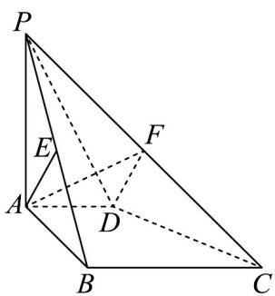

<!-- question-source:start -->
15. 如图，在四棱锥 $P - ABCD$ 中， $PA \perp$ 平面 $ABCD, PA = AB, AD // BC, AD \perp AB, E$ 是棱 $PB$

的中点， $AB = BC = 2AD = 2$

(1)证明: $AE \perp$ 平面 $PBC$ .

(2)求点 E 到平面 PCD 的距离.

(3)若点 $F$ 在棱 $PC$ 上，求平面 $ADF$ 与平面 $PCD$ 所夹锐角的余弦值的最小值·
<!-- question-source:end -->

![[高中/课堂同步/题库/人教A版高中数学同步讲义(2026)/03_选择性必修第一册/第一章 空间向量与立体几何/第一章 空间向量与立体几何（高效培优单元测试·提升卷）/三_填空题/questions/answers/Q00079957A1.md]]
