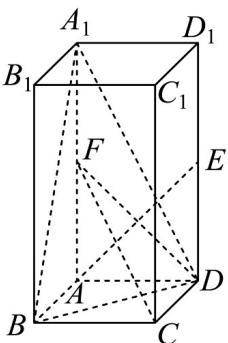

<!-- question-source:start -->
16. 如图，在正四棱柱 $ABCD - A_{1}B_{1}C_{1}D_{1}$ 中， $AA_{1} = 2AB = 2, E, F$ 分别为棱 $DD_{1}, AA_{1}$ 的中点.

(1)证明： $AE \perp$ 平面 CDF；

(2)求平面 $CDF$ 与平面 $A_{1}BD$ 的夹角.
<!-- question-source:end -->

![[高中/课堂同步/题库/人教A版高中数学同步讲义(2026)/03_选择性必修第一册/第一章 空间向量与立体几何/第一章 空间向量与立体几何（高效培优单元测试·提升卷）/三_填空题/questions/answers/Q00079958A1.md]]
