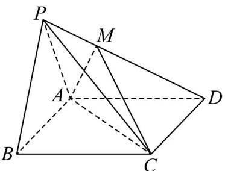

<!-- question-source:start -->
17. 如图，在四棱锥 $P - ABCD$ 中，四边形 $ABCD$ 为正方形， $AB = 6$ ， $PC = PD = \sqrt{57}$ ，二面角

$P - CD - A$ 的大小为 $\frac{\pi}{6}$

(1)证明：平面 $PAB \perp$ 平面 $ABCD$ .

(2)若点 $M$ 在线段 $PD$ 上，且平面 $MAC \perp$ 平面 $ABCD$ ，求直线 $AM$ 与平面 $PBC$ 所成角的正弦值
<!-- question-source:end -->

![[高中/课堂同步/题库/人教A版高中数学同步讲义(2026)/03_选择性必修第一册/第一章 空间向量与立体几何/第一章 空间向量与立体几何（高效培优单元测试·提升卷）/三_填空题/questions/answers/Q00079959A1.md]]
