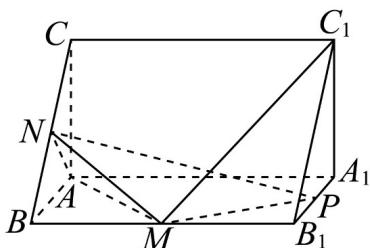

<!-- question-source:start -->
18. 如图，在直三棱柱 $ABC - A_{1}B_{1}C_{1}$ 中， $\angle BAC = 90^{\circ}$ ， $AB = AC = 2$ ， $AA_{1} = 4$ ， $M$ 、 $N$ 、 $P$ 分别是 $BB_{1}$ 、

BC、 $A_{1}B_{1}$ 的中点·

(1)证明： $C_1M\perp$ 平面 $AMN$ ；

(2)求 $C_1M$ 与平面PMN所成角的正弦值；

(3)求点 P 到平面 AMN 的距离.
<!-- question-source:end -->

![[高中/课堂同步/题库/人教A版高中数学同步讲义(2026)/03_选择性必修第一册/第一章 空间向量与立体几何/第一章 空间向量与立体几何（高效培优单元测试·提升卷）/三_填空题/questions/answers/Q00079960A1.md]]
