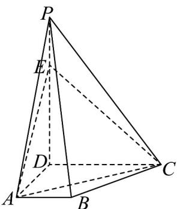

<!-- question-source:start -->
19. 如图，已知四棱锥 $P - ABCD$ ， $PD \perp$ 底面 $ABCD$ ， $AB // CD$ ， $AB \perp AD$ ， $2AB = CD = 2$

$PD = AD = 3$ ， $E$ 为棱 $PD$ 上靠近点 $P$ 的三等分点.

(1)证明：直线 $PB / /$ 平面 $AEC$ ；

(2)求直线 $CE$ 与平面 $PBC$ 所成角的正弦值.
<!-- question-source:end -->

![[高中/课堂同步/题库/人教A版高中数学同步讲义(2026)/03_选择性必修第一册/第一章 空间向量与立体几何/第一章 空间向量与立体几何（高效培优单元测试·提升卷）/三_填空题/questions/answers/Q00079961A1.md]]
