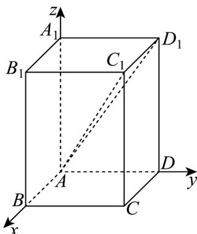
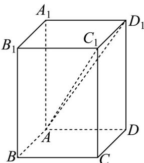
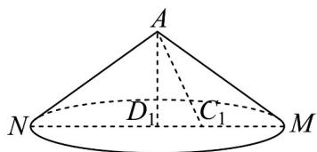

> [!faq]- 《第一章 空间向量与立体几何（高效培优单元测试·提升卷）》官方解析
>
> > [!success]- **【答案】** $\left[5\sqrt{3} - 8, 5\sqrt{3} + 8\right]$
>
> > [!note]- **【分析】**
> > 方法一：根据题意建立空间直角坐标系，设点 $Q(x,y,z)$ ，再由 $\angle DAD_{1}=\angle QAD_{1}$ 转化为 $\left|\cos\left\langle\stackrel{\square\square\square\square}{AD},\stackrel{\square\square\square\square}\right\rangle\right|=\left|\cos\left\langle\stackrel{\square\square\square\square}{AQ},\stackrel{\square\square\square\square}\right\rangle\right|$ ，可得Q的轨迹方程，因线段AQ长度不会影响夹角，故不妨取 $\left|AQ\right|=\sqrt{x^{2}+y^{2}+z^{2}}=1$ 简化运算，再把 $\left|\cos<\stackrel{\square\square\square\square}{AQ},\stackrel{\square\square\square\square\square}{AC_{1}}> \right|$ 表示出来，即可求得取值范围，再转化为正切值的
> >
> > 取值范围即可·
> >
> > 方法二、根据题意可得 $\angle DAD_{1} = \angle QAD_{1} = \frac{\pi}{3}$ ，所以点 $Q$ 的轨迹是以 $AD_{1}$ 为轴的圆锥侧面，由圆锥的对称性
> >
> > 即可得出答案·
>
> > [!note]- **【解析】**
> > 方法一：如图，以 A 为原点，建立空间直角坐标系，
> >
> > 
> >
> > $$
> > \therefore A (0, 0, 0), D (0, 1, 0), D _ {1} (0, 1, \sqrt {3}), C _ {1} (1, 1, \sqrt {3})
> > $$
> >
> > 设 $Q(x,y,z)$
> >
> > $$
> > \therefore \angle D A D _ {1} = \angle Q A D _ {1}, \therefore \left| \cos \left\langle A D, A D _ {1} \right\rangle \right| = \left| \cos \left\langle A Q, A D _ {1} \right\rangle \right|
> > $$
> >
> > 即 $\frac{\left|y + \sqrt{3}z\right|}{2\sqrt{x^2 + y^2 + z^2}} = \frac{1}{2}$ ，不妨取 $\left|AQ\right| = \sqrt{x^2 + y^2 + z^2} = 1$
> >
> > $$
> > \therefore \left| y + \sqrt {3} z \right| = 1
> > $$
> >
> > 若 $y = 1 - \sqrt{3} z$ ，则 $x^{2} = 1 - y^{2} - z^{2} = 1 - (1 - \sqrt{3} z)^{2} - z^{2} = -4z^{2} + 2\sqrt{3} z = -4\left(z - \frac{\sqrt{3}}{4}\right)^{2} + \frac{3}{4}$
> >
> > $\therefore x^{2} \leq \frac{3}{4}$ ，即 $x \in \left[-\frac{\sqrt{3}}{2}, \frac{\sqrt{3}}{2}\right]$
> >
> > $$
> > \therefore \left| \cos \left\langle A Q, A C _ {1} \right\rangle \right| = \left| \frac {x + y + \sqrt {3} z}{\sqrt {x ^ {2} + y ^ {2} + z ^ {2}} \cdot \sqrt {5}} \right| = \left| \frac {x + 1}{\sqrt {5}} \right| \in \left[ \frac {- \sqrt {1 5} + 2 \sqrt {5}}{1 0}, \frac {\sqrt {1 5} + 2 \sqrt {5}}{1 0} \right],
> > $$
> >
> > 若 $y = -1 - \sqrt{3} z$ ，则 $x^{2} = 1 - y^{2} - z^{2} = 1 - \left(1 + \sqrt{3} z\right)^{2} - z^{2} = -4z^{2} - 2\sqrt{3} z = -4\left(z + \frac{\sqrt{3}}{4}\right)^{2} + \frac{3}{4}$
> >
> > $\therefore x^{2} \leq \frac{3}{4}$ ，即 $x \in \left[-\frac{\sqrt{3}}{2}, \frac{\sqrt{3}}{2}\right]$
> >
> > $$
> > \therefore \left| \cos \left\langle A Q, A C _ {1} \right\rangle \right| = \left| \frac {x + y + \sqrt {3} z}{\sqrt {x ^ {2} + y ^ {2} + z ^ {2}} \cdot \sqrt {5}} \right| = \left| \frac {x - 1}{\sqrt {5}} \right| \in \left[ \frac {- \sqrt {1 5} + 2 \sqrt {5}}{1 0}, \frac {\sqrt {1 5} + 2 \sqrt {5}}{1 0} \right],
> > $$
> >
> > ∴直线 AQ 与 $AC_{1}$ 所成角的正切值的取值范围为 $\left[5\sqrt{3}-8,5\sqrt{3}+8\right]$
> >
> > 故答案为： $\left[5\sqrt{3} -8,5\sqrt{3} +8\right]$
> >
> > 方法二：如图在长方体 $ABCD - A_{1}B_{1}C_{1}D_{1}$ 中，底面 $ABCD$ 是边长为 $^{1}$ 的正方形， $AA_{1} = \sqrt{3}$
> >
> > 
> >
> > $\therefore AD_{1} = 2, AC_{1} = \sqrt{5}, \angle DAD_{1} = \angle QAD_{1} = \frac{\pi}{3}, \tan \angle C_{1}AD_{1} = \frac{1}{2}$
> >
> > $$
> > \therefore \angle D A D _ {1} = \angle Q A D _ {1} = \frac {\pi}{3}
> > $$
> >
> > ∴不妨取 AQ = 4 ，则点 Q 的轨迹是以 $AD_{1}$ 为轴，且 $\angle MAN = \frac{2\pi}{3}$ 的圆锥底面圆，
> >
> > 图形如下：
> >
> > 
> >
> > ∴当 Q 在 M 时，直线 AQ 与 $AC_{1}$ 所成角取得最小值，
> >
> > $$
> > \tan \angle M A C _ {1} = \tan (\angle M A D _ {1} - \angle D _ {1} A C _ {1}) = \tan \left(\frac {\pi}{3} - \angle D _ {1} A C _ {1}\right) = \frac {\sqrt {3} - \frac {1}{2}}{1 + \frac {\sqrt {3}}{2}} = 5 \sqrt {3} - 8,
> > $$
> >
> > :当 Q 在 N 时，直线 AQ 与 $AC_{1}$ 所成角取得最大值，
> >
> > $$
> > \tan \angle N A C _ {1} = \tan (\angle N A D _ {1} + \angle D _ {1} A C _ {1}) = \tan \left(\frac {\pi}{3} + \angle D _ {1} A C _ {1}\right) = \frac {\sqrt {3} + \frac {1}{2}}{1 - \frac {\sqrt {3}}{2}} = 8 + 5 \sqrt {3},
> > $$
> >
> > ∴直线 AQ 与 $AC_{1}$ 所成角的正切值的取值范围为 $\left[5\sqrt{3}-8,5\sqrt{3}+8\right]$
> >
> > 故答案为： $\left[5\sqrt{3} -8,5\sqrt{3} +8\right]$
