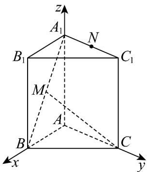

> [!faq]- 《第一章 空间向量与立体几何（高效培优单元测试·提升卷）》官方解析
>
> > [!success]- **【答案】** $\frac{\sqrt{78}}{6}/\frac{1}{6}\sqrt{78}$
>
> > [!note]- **【分析】**
> > 构建合适的空间直角坐标系，标注出相关点的坐标，应用向量法求点线距离
>
> > [!note]- **【解析】**
> > 由题设，构建如下图示的空间直角坐标系 $A - xyz$ ，则 $C(0,1,0),M(1,0,1),N(0,\frac{1}{2},2)$
> >
> > 
> >
> > 所以 $\overline{CM} = (1, -1, 1), \overline{CN} = (0, -\frac{1}{2}, 2)$
> >
> > 则点 $N$ 到直线 $CM$ 的距离 $\sqrt{\frac{CN}{|CM|}^2 - (\frac{CN\cdot CM}{|CM|})^2} = \sqrt{\frac{17}{4} - (\frac{5}{2\sqrt{3}})^2} = \sqrt{\frac{13}{6}} = \frac{\sqrt{78}}{6}$ .
> >
> > 故答案为： $\frac{\sqrt{78}}{6}$
> >
> > 四、解答题：本题共5小题，共77分。解答应写出文字说明、证明过程或演算步骤。
