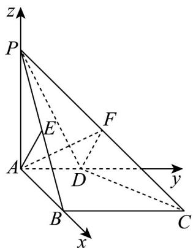
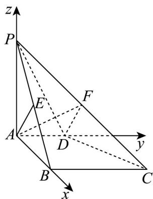

> [!faq]- 《第一章 空间向量与立体几何（高效培优单元测试·提升卷）》官方解析
>
> > [!success]- **【答案】** (1)证明见解析 (2) $\frac{\sqrt{6}}{3}$ (3) $\frac{\sqrt{6}}{6}$
>
> > [!note]- **【分析】**
> > （1）应用线面垂直得出 $PA \perp BC$ 结合已知应用线面垂直判定定理得出 $BC \perp$ 平面PAB，再应用线
> >
> > 面垂直证明即可；
> >
> > (2) 建立空间直角坐标系，先求出平面 PCD 的法向量，再根据点到平面距离公式计算求解；
> >
> > (3) 应用空间向量法求出平面 $ADF$ 与平面 $PCD$ 的法向量，再应用面面角余弦公式计算再结合二次函数值
> >
> > 域计算求解·
>
> > [!note]- **【解析】**
> > （1）因为 $PA \perp$ 平面ABCD，且 $BC \subset$ 平面ABCD，所以 $PA \perp BC$ ，
> >
> > 因为 $AD \parallel BC$ ，且 $AD \perp AB$ ，所以 $BC \perp AB$ ，
> >
> > 且 $PA \cap AB = A$ ，PA, $AB \subset$ 平面 PAB，
> >
> > 所以 $BC \perp$ 平面 PAB ，
> >
> > 因为 $AE \subset$ 平面 PAB ，所以 $BC \perp AE$
> >
> > 因为 PA = AB ， E 是棱 PB 的中点，所以 $AE \perp PB$ ，
> >
> > 因为 $PB$ ， $BC\subset$ 平面 $PBC$ ，且 $PB\cap BC = B$ ，所以 $AE\bot$ 平面 $PBC$
> >
> > (2) 以 A 为坐标原点，分别以 $AB, AD, AP$ 的方向为 $x$ ， $y$ ， $z$ 轴的正方向建立如图所示的空间直角坐标系。
> >
> > 
> >
> > 因为 $AD = 1$ ，所以 $A(0,0,0)$ ， $C(2,2,0)$ ， $D(0,1,0)$ ， $P(0,0,2)$ ， $B(2,0,0)$
> >
> > 则 $AD = (0,1,0), PC = (2,2,-2), PD = (0,1,-2)$
> >
> > 因为点 E 在棱 PB 中点上，所以 E 的坐标为 $(1,0,1)$ ， $ED = (-1,1,-1)$
> >
> > 设平面 $PCD$ 的法向量为 $n = (x, y, z)$
> >
> > 则 $\left\{\begin{aligned}&\vec{n}\cdot PEC=0\\ &n\cdot PD=0\end{aligned}\right.\Rightarrow\left\{\begin{aligned}&2x+2y-2z=0\\ &y-2z=0\end{aligned}\right.$ ，令 y=2，得 $n=(-1,2,1)$ ，
> >
> > $$
> > \therefore d = \frac {\left| \overrightarrow {E D} \cdot n \right|}{\left| n \right|} = \frac {2}{\sqrt {6}} = \frac {\sqrt {6}}{3}
> > $$
> >
> > (3) 以 A 为坐标原点，分别以 $AB, AD, AP$ 的方向为 $x$ ， $y$ ， $z$ 轴的正方向建立如图所示的空间直角坐标系。
> >
> > 
> >
> > 因为 AD = 1 ，所以 $A(0,0,0)$ , $C(2,2,0)$ , $D(0,1,0)$ , $P(0,0,2)$
> >
> > 则 $AD = (0,1,0), PC = (2,2,-2), PD = (0,1,-2)$
> >
> > 因为点 $F$ 在棱 $PC$ 上，所以 $\overline{PF} = \lambda \overline{PC} = (2\lambda, 2\lambda, -2\lambda)$
> >
> > 则 $F(2\lambda, 2\lambda, -2\lambda + 2)$ ，故 $AF = (2\lambda, 2\lambda, -2\lambda + 2)$
> >
> > 设平面 $ADF$ 的法向量为 $m = (x_0, y_0, z_0)$
> >
> > 则 $\left\{ \begin{array}{l}m\cdot AD = y_0 = 0\\ \rightarrow \square \square \\ m\cdot AF = 2\lambda x_0 + 2\lambda y_0 + (-2\lambda +2)z_0 = 0 \end{array} \right.$
> >
> > 令 $x_{0}=\lambda-1$ ，得 $m=(\lambda-1,0.\lambda)$ ，
> >
> > 由 $(2)$ 知平面PCD的一个法向量 $n=(-1,2,1)$
> >
> > 设平面 ADF 与平面 PCD 的夹角为 $\theta$
> >
> > $$
> > \cos \theta = \left| \cos \langle \stackrel {\leftrightarrow} {m, n} \rangle \right| = \frac {1}{\sqrt {1 2 \left[ \left(\lambda - \frac {1}{2}\right) ^ {2} + \frac {1}{4} \right]}}
> > $$
> >
> > 因为 $_{0} \leq \lambda \leq 1$ ，所以 $\sqrt{3} \leq \sqrt{12\left[\left(\lambda - \frac{1}{2}\right)^{2} + \frac{1}{4}\right]} \leq \sqrt{6}$ ，
> >
> > 所以 $\frac{\sqrt{6}}{6} \leq \frac{1}{\sqrt{12\left[\left(\lambda - \frac{1}{2}\right)^2 + \frac{1}{4}\right]}} \leq \frac{\sqrt{3}}{3}$
> >
> > 即 $\frac{\sqrt{6}}{6} \leq \cos \theta \leq \frac{\sqrt{3}}{3}$
> >
> > 故平面 $ADF$ 与平面 $PCD$ 夹角的余弦值的最小值为 $\frac{\sqrt{6}}{6}$
