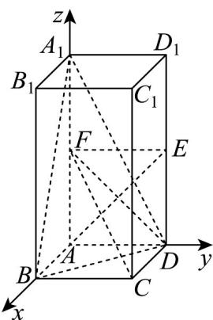

> [!faq]- 《第一章 空间向量与立体几何（高效培优单元测试·提升卷）》官方解析
>
> > [!success]- **【答案】** (1)证明见解析 (2) $\frac{\pi}{4}$
>
> > [!note]- **【分析】**
> > （1）连接 $EF$ ，利用正方形的性质得 $AE \perp DF$ ，再利用线面垂直的性质定理得 $CD \perp AE$ ，进而利
> >
> > 用线面垂直的判定定理证明即可·
> >
> > (2) 建立空间直角坐标系，求出平面 $CDF$ 与平面 $A_{1}BD$ 的法向量，然后利用向量法求出平面的夹角即可·
>
> > [!note]- **【解析】**
> > （1）连接 $EF$ ，因为 $E, F$ 分别为棱 $DD_{1}, AA_{1}$ 的中点，所以 $AD // EF$ 且 $AD = EF$ .
> >
> > 则四边形 ADEF 是正方形，则 $AE \perp DF$ ，
> >
> > 由正四棱柱的性质可知 $CD \perp$ 平面 $ADD_{1}A_{1}$
> >
> > 因为 $AE \subset$ 平面 $ADD_{1}A_{1}$ ，所以 $CD \perp AE$ ，
> >
> > 因为 $DF \subset$ 平面 $CDF, CD \subset$ 平面 CDF ，且 $DF \mid CD = D$
> >
> > 所以 $AE \perp$ 平面 $CDF$ .
> >
> > (2) 由正四棱柱的性质可知 $AB, AD, AA_{1}$ 两两垂直，
> >
> > 则以 A 为坐标原点， $AB, AD, AA_{1}$ 的方向分别为 x, y, z 轴的正方向，
> >
> > 建立如图所示的空间直角坐标系·
> >
> > 因为 $AA_{1} = 2AB = 2AD = 2$
> >
> > 则 $A(0,0,0), A_1(0,0,2), B(1,0,0), D(0,1,0), E(0,1,1)$
> >
> > 故 $AE = (0,1,1), A_1B = (1,0,-2), BD = (-1,1,0)$
> >
> > 设平面 $A_{1}BD$ 的法向量为 $n = (x,y,z)$
> >
> > 则 $\left\{ \begin{array}{l}n\cdot A,B = x - 2z = 0,\\ \rightarrow \square \square \\ n\cdot BD = -x + y = 0, \end{array} \right.$ 令 $x = 2$ ，得 $y = 2,z = 1$
> >
> > 则 $n = (2,2,1)$
> >
> > 
> >
> > 由（1）可知 $AE \perp$ 平面 $CDF$
> >
> > 则 $\stackrel{\square\square\square}{AE}=(0,1,1)$ 是平面 CDF 的一个法向量，
> >
> > 设平面 CDF 与平面 $A_{1}BD$ 的夹角为 $\theta$ ，
> >
> > 则 $\cos\theta=\left|\cos\left\langle\vec{n},AE\right\rangle\right|=\frac{\left|n\cdot AE\right|}{\left|n\right|\left|AE\right|}=\frac{2+1}{\sqrt{4+4+1}\times\sqrt{1+1}}=\frac{\sqrt{2}}{2}$
> >
> > 因为 $0 < \theta \leq \frac{\pi}{2}$ ，所以 $\theta = \frac{\pi}{4}$ ，
> >
> > 即平面 $CDF$ 与平面 $A_{1}BD$ 的夹角为 $\frac{\pi}{4}$
