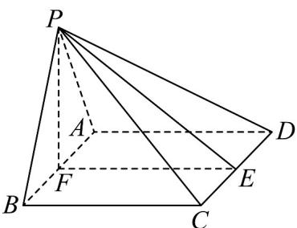
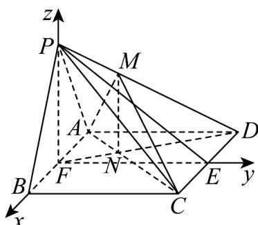

> [!faq]- 《第一章 空间向量与立体几何（高效培优单元测试·提升卷）》官方解析
>
> > [!success]- **【答案】** $^{(1)}$ 证明见解析 (2) $\frac{2\sqrt{210}}{35}$
>
> > [!note]- **【分析】**
> > （1）取 $CD$ 中点 $E$ ， $AB$ 中点 $F$ ，连接 $PE$ ， $PF$ ， $EF\cdot$ 先证 $CD \perp$ 平面 $PEF$ ，再结合勾股定理的
> >
> > 逆定理证明 $PF \perp EF$ ，结合线面垂直的性质和判定定理，证明 $PF \perp$ 平面ABCD，再利用面面垂直的判定
> >
> > 定理，可证明结论·
> >
> > (2) 结合 (1) 的结论，建立空间直角坐标系，根据条件，确定 $M$ 点的位置，利用三角形的相似，确定
> >
> > 点的坐标，利用向量法求线面角的正弦值即可·
>
> > [!note]- **【解析】**
> > （1）如图：
> >
> > 
> >
> > 取 CD 中点 E，AB 中点 F，连接 PE，PF，EF。
> >
> > 因为 $PC = PD = \sqrt{57}$ ，所以 $PE \perp CD$ 。
> >
> > 所以 $PE = \sqrt{PC^{2} - CE^{2}} = \sqrt{57 - 9} = 4\sqrt{3}$ .
> >
> > 又因为四边形 ABCD 是正方形，所以 $EF \perp CD$ .
> >
> > 所以 $\angle PEF$ 为二面角 P-CD-A 的平面角，为 $\frac{\pi}{6}$ .
> >
> > 在！PEF中，由余弦定理得： $PF^{2}=EP^{2}+EF^{2}-2EP\cdot EF\cdot\cos\frac{\pi}{6}=48+36-2\times4\sqrt{3}\times6\times\frac{\sqrt{3}}{2}=12\cdot$
> >
> > 因为 $12 + 36 = 48$ ，即 $PF^{2} + EF^{2} = PE^{2}$ ，所以 $\Phi PFE = \frac{\pi}{2}$ .
> >
> > 由 $PE \perp CD$ ， $EF \perp CD$ ， $PE, EF \subset$ 平面 PEF，且 $PE \cap EF = E$ ，
> >
> > 所以 $CD \perp$ 平面 PEF.
> >
> > 又 $PF \subset$ 平面 $PEF$ ，所以 $CD \perp PF$ .
> >
> > 又 $PF \perp EF$ ，EF, CD ⊂ 平面 ABCD， $EF \cap CD = E$ ，所以 $PF \perp$ 平面 ABCD.
> >
> > 又 $PF \subset$ 平面 $PAB$ ，所以平面 $PAB \perp$ 平面 $ABCD$ .
> >
> > (2) 如图：
> >
> > 
> >
> > 连接 FD，交 AC 于 N，连接 MN。
> >
> > 因为 $PF \perp$ 平面ABCD， $PF \subset$ 平面PFD，所以面 $PFD \perp$ 平面ABCD，
> >
> > 又平面 $MAC \perp$ 平面 $ABCD$ ，平面 $MAC \cap$ 平面 $PFD = MN$
> >
> > 所以 $MN \perp$ 平面 ABCD.
> >
> > 因为 $FB, FE, FP$ 两两垂直，故可以 $F$ 为原点，建立如图空间直角坐标系
> >
> > 则 $F(0,0,0)$ ， $B(3,0,0)$ ， $C(3,6,0)$ ， $A(-3,0,0)$ ， $P(0,0,2\sqrt{3})$
> >
> > 因为 $\triangle AFN\sim \triangle CDN$ ，且 $\frac{FN}{DN} = \frac{AF}{CD} = \frac{1}{2}$ ，所以 $N(-1,2,0)$
> >
> > 因为 $MN // PF$ ，所以 $\frac{MN}{PF} = \frac{DN}{DF} = \frac{2}{3}$ ，所以 $MN = \frac{4\sqrt{3}}{3}$ ，所以 $M\left(-1,2,\frac{4\sqrt{3}}{3}\right)$
> >
> > 所以 $\overset{\square\square\square\square}{AM}=\left(2,2,\frac{4\sqrt{3}}{3}\right)$ ， $\overset{\square\square\square\square}{BP}=\left(-3,0,2\sqrt{3}\right)$ ， $\overset{\square\square\square\square}{BC}=\left(0,6,0\right)\cdot$
> >
> > 设平面 PBC 的法向量为 $m = (x, y, z)$
> >
> > $$
> > \left\{\begin{array}{l}m \perp \stackrel {{\square \sqcup \sqcup}} {{\rightarrow}} B P\\m \perp B C\end{array}\Rightarrow \left\{\begin{array}{l}(x, y, z) \cdot (- 3, 0, 2 \sqrt {3}) = 0\\(x, y, z) \cdot (0, 6, 0) = 0\end{array}\right. \Rightarrow \left\{\begin{array}{l}- 3 x + 2 \sqrt {3} z = 0\\y = 0\end{array}\right. \right.
> > $$
> >
> > 取 $m = (2,0,\sqrt{3})$
> >
> > $$
> > \text {则} \quad \cos A M, m = \frac {\overrightarrow {A M} \cdot \overrightarrow {m}}{\left| A M \right| \cdot \left| m \right|} = \frac {\left(2 , 2 , \frac {4 \sqrt {3}}{3}\right) \cdot \left(2 , 0 , \sqrt {3}\right)}{\sqrt {2 ^ {2} + 2 ^ {2} + \left(\frac {4 \sqrt {3}}{3}\right) ^ {2}} \cdot \sqrt {2 ^ {2} + 3}} = \frac {8}{\frac {2 \sqrt {3 0}}{3} \times \sqrt {7}} = \frac {2 \sqrt {2 1 0}}{3 5}.
> > $$
> >
> > 即为所求直线 AM 与平面 PBC 所成角的正弦值.
