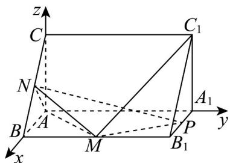

> [!faq]- 《第一章 空间向量与立体几何（高效培优单元测试·提升卷）》官方解析
>
> > [!success]- **【答案】** (1)证明见解析 (2) $\frac{\sqrt{7}}{7}$ (3) $\sqrt{3}$
>
> > [!note]- **【分析】**
> > （1）以A为原点建立空间直角坐标系 $A - xyz$ ，求出 $\overline{AM},\overline{AN},C_1M$ 坐标，利用向量证明
> >
> > $C_{1}M\perp AM$ ， $C_1M\perp AN$ ，根据线面垂直的判定定理证明；
> >
> > (2) 求出平面 PMN 的一个法向量，利用向量法求线面角；
> >
> > (3) 由 (1) 平面 $AMN$ 的一个法向量为 $\overline{C_1M} = (2, -2, -2)$ ，利用向量法求解
>
> > [!note]- **【解析】**
> > （1）在直三棱柱中， $\angle BAC = 90^{\circ}$ ，则 $AB$ ， $AA_{1}$ ， $AC$ 两两垂直，
> >
> > 如图，以 A 为原点建立空间直角坐标系 A - xyz
> >
> > 
> >
> > 则 $A(0,0,0)$ ， $N(1,0,1)$ ， $C_1(0,4,2)$ ， $M(2,2,0)$ ， $P(1,4,0)$
> >
> > 所以 $AM = (2, 2, 0)$ ， $AN = (1, 0, 1)$ ， $C_{1}M = (2, -2, -2)$
> >
> > 由 $C_1M \cdot AM = 4 - 4 + 0 = 0$ ，则 $C_1M \perp AM$
> >
> > 由 $C_{1}M \cdot AN = 2 + 0 - 2 = 0$ ，则 $C_{1}M \perp AN$
> >
> > 由 $AM \cap AN = A$ ，且 AM, AN 都在平面 AMN 内，则 $C_{1}M \perp$ 平面 AMN.
> >
> > (2) 设平面 $PMN$ 的一个法向量 $n = (x, y, z)$ , $\overline{NP} = (0, 4, -1)$ , $\overline{NM} = (1, 2, -1)$
> >
> > 所以 $\left\{\begin{aligned}n\cdot NP&=4y-z=0\\ \rightarrow &NM=x+2y-z=0\end{aligned}\right.$ ，取 $y=1$ ，则 $n=(2,1,4)$ ，
> >
> > 所以 $\left|\cos C_{1}M, n\right| = \left|\frac{\square\square\square\square}{C_{1}M}\cdot n}{\left|C_{1}M\right|\left|n\right|} = \left|\frac{4 - 2 - 8}{2\sqrt{3} \times \sqrt{21}}\right| = \frac{\sqrt{7}}{7}$
> >
> > 故 $C_1M$ 与平面PMN所成角的正弦值为 $\frac{\sqrt{7}}{7}$
> >
> > (3) 由 (1) 知平面 $AMN$ 的一个法向量为 $\overline{C_1M} = (2, -2, -2)$ ，由 (2) 知 $\overline{AP} = (1, 4, 0)$
> >
> > 所以点 $P$ 到平面 $AMN$ 的距离 $\left|\frac{AP\cdot C_1M}{C_1M}\right| = \left|\frac{2 - 8 - 0}{2\sqrt{3}}\right| = \sqrt{3}$
