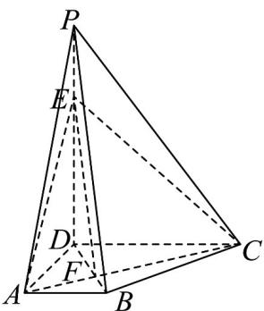
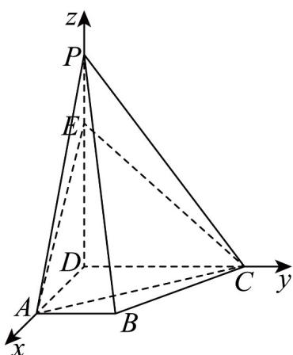

> [!faq]- 《第一章 空间向量与立体几何（高效培优单元测试·提升卷）》官方解析
>
> > [!success]- **【答案】** (1)证明见解析 $$ \sqrt {7} $$ (2) $\overline{14}$
>
> > [!note]- **【分析】**
> > （1）由相似三角形可得线段比例，从而可得线线平行，根据线面平行的判定，可得答案；
> >
> > (2) 由题意建立空间直角坐标，求得直线的方向向量以及平面的法向量，利用线面角的向量公式，可得
> >
> > 答案·
>
> > [!note]- **【解析】**
> > （1）连接 $BD$ ，记 $BD \cap AC = F$ ，连接 $EF$ ，如下图：
> >
> > 
> >
> > 在梯形 $ABCD$ 中，易知 $\triangle ABF\sim \triangle CDF$ ，则 $\frac{BF}{DF} = \frac{AB}{CD} = \frac{1}{2}$
> >
> > 由题意可得 $\frac{EP}{DE} = \frac{1}{2}$ ，所以 PB // EF，
> >
> > 因为 $EF \subset$ 平面 ACE ， BP ∉ 平面 ACE ，
> >
> > 所以 $PB / /$ 平面 $ACE$ .
> >
> > (2) 由题意易知 DA, DC, DP 两两垂直，
> >
> > 以 D 为原点，分别以 DA, DC, DP 所在直线为 x, y, z 轴，建立空间直角坐标系，
> >
> > 
> >
> > 则 $E(0,0,2)$ ， $P(0,0,3)$ ， $B(3,1,0)$ ， $C(0,2,0)$
> >
> > 可得 $\overline{CE}=(0,-2,2)$ ， $\overline{CP}=(0,-2,3)$ ， $\overline{CB}=(3,-1,0)$
> >
> > 设平面 $PBC$ 的法向量 $n = (x,y,z)$ ，则 $\left\{ \begin{array}{l} n \cdot CP = -2y + 3z = 0 \\ n \cdot CB = 3x + -y = 0 \end{array} \right.$
> >
> > 令 $y = 3$ ，则 $x = 1, z = 2$ ，所以平面 $PBC$ 的一个法向量 $n = (1,3,2)$
> >
> > 设直线 CE 与平面 PEC 所成角为 $\theta$
> >
> > $$
> > \sin \theta = \frac {\left| n \cdot \overrightarrow {C E} \right|}{\left| n \right| \cdot \left| C E \right|} = \frac {\left| - 6 + 4 \right|}{\sqrt {1 + 9 + 4} \times \sqrt {4 + 4}} = \frac {\sqrt {7}}{1 4}
> > $$
