<!-- source-part:1 pages:1-50 -->

## 第一章 空间向量与立体几何

## 内容概览

## 教学目标、教学重难点

<table><tr><td>教学目标</td><td>1.理解空间向量的概念,空间向量的共线定理、共面定理及推论.2.会进行空间向量的线性运算,空间向量的数量积,空间向量的夹角的相关运算.3.会进行空间向量的线性运算,空间向量的数量积,空间向量的夹角的相关运算.4.理解并记住共线向量基本定理、平面向量基本定理、共面向量定理及空间向量基本定理的内容及含义.5.理解基底与基向量的含义,会用恰当的基向量表示空间任意向量.6.会用相关的定理解决简单的空间几何问题.7.理解和掌握空间向量的坐标表示及意义,会用向量的坐标表达空间向量的相关运算.会求空间向量的夹角、长度以及有关平行、垂直的证明.8.理解与掌握直线的方向向量,平面的法向量.9.会用方向向量,法向量证明线线、线面、面面间的平行关系;会用平面法向量证明线面和面面垂直,并能用空间向量这一工具解决与平行、垂直有关的立体几问题.</td></tr><tr><td>教学重难点</td><td>1.重点会用向量法求线线、线面、面面的夹角及与其有关的角的三角函数值;会用向量法求点点、点线、点面、线线、线面、面面之间的距离及与其有关的面积与体积.2.难点通过本节课的学习,提升平面向量、空间向量的知识相结合的综合能力,准确将平面向量、空间向量的概念,定理等内容与平面几何、空间立体几何有机的隔合在一起,提升解决问题的能力,将形与数,数与量有机的结合起来,为提升数学能力奠定基础.</td></tr></table>

## 知识清单

## 知识点 01 空间向量的线性运算

## （一）空间向量的加减运算

<table><tr><td rowspan="2">加法运算</td><td rowspan="2">三角形法则</td><td>语言叙述</td><td colspan="2">首尾顺次相接,首指向尾为和</td></tr><tr><td>图形叙述</td><td></td><td>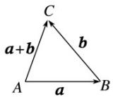</td></tr><tr><td rowspan="2"></td><td rowspan="2">平行四边形法则</td><td>语言叙述</td><td colspan="2">共起点的两边为邻边作平行四边形,共起点对角线为和</td></tr><tr><td>图形叙述</td><td colspan="2"></td></tr><tr><td rowspan="2">减法运算</td><td rowspan="2">三角形法则</td><td>语言叙述</td><td colspan="2">共起点,连终点,方向指向被减向量</td></tr><tr><td>图形叙述</td><td colspan="2">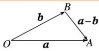</td></tr><tr><td rowspan="2">加法运算</td><td>交换律</td><td colspan="3">a+b=b+a</td></tr><tr><td>结合律</td><td colspan="3">(a+b)+c=a+(b+c)</td></tr></table>

## （二）空间向量的数乘运算

<table><tr><td>定义</td><td colspan="3">与平面向量一样,实数λ与空间向量a的乘积λa仍然是一个向量,称为空间向量的数乘</td></tr><tr><td rowspan="3">几何意义</td><td>λ&gt;0</td><td>λa与向量a的方向相同</td><td rowspan="3">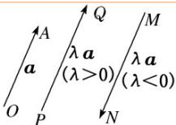λa的长度是a的长度的 $\lambda$ 倍</td></tr><tr><td>λ&lt;0</td><td>λa与向量a的方向相反</td></tr><tr><td>λ=0</td><td>λa=0,其方向是任意的</td></tr><tr><td rowspan="2">运算律</td><td>结合律</td><td colspan="2"> $\lambda(\mu a)=(\lambda\mu)a$ </td></tr><tr><td>分配律</td><td colspan="2"> $(\lambda+\mu)a=\lambda a+\mu a,\lambda(a+b)=\lambda a+\lambda b$ </td></tr></table>

## 【即学即练】

1．如图，在四面体OABC中，设 $OA = a, OB = b, OC = c$ ， $G$ 为 $\triangle OAB$ 的重心， $H$ 为 $AC$ 的中点，则 $GH =$

( )

A. $\frac{1}{6} a - \frac{1}{3} b + \frac{1}{2} c$ B. $-\frac{2}{3} a - \frac{1}{3} b - \frac{1}{3} c$ C. $\frac{1}{6} a - \frac{1}{3} b + \frac{1}{3} c$ D. $-\frac{2}{3} a - \frac{1}{3} b + \frac{1}{2} c$

【答案】A

【详解】

如图，连接 $OH$ ，连接 $OG$ 并延长交 $AB$ 于点 $D$ ，则 $D$ 为 $AB$ 中点，且

$\therefore \overrightarrow{OG} = \frac{2}{3} \cdot \frac{1}{2} \left( \overrightarrow{OA} + \overrightarrow{OB} \right) = \frac{1}{3} \left( \overrightarrow{a} + \overrightarrow{b} \right)$ .

∵ $_{H}$ 为 AC 的中点，∴ $\stackrel{\square\square}{OH} = \frac{1}{2}\left(\stackrel{\square\square}{OA} + \stackrel{\square\square}{OC}\right) = \frac{1}{2}\left(\stackrel{\rightarrow}{a+c}\right)$

$$
G H = O H - O G = \frac {1}{2} (a + c) - \frac {1}{3} (a + b) = \frac {1}{6} a - \frac {1}{3} b + \frac {1}{2} c
$$

故选：A.

2. 在三棱锥 $P - ABC$ 中， $M$ 是平面 $ABC$ 内一点，且 $9PM = 8PA + tPB + 5MC$ ，则 $t = (\quad)$ A. $\frac{1}{2}$ B. 1 C. 2 D. 3

【答案】B

【详解】因为 $9PM = 8PA + tPB + 5MC = 8PA + tPB + 5\left(PC - PM\right)$

所以 $14PM = 8PA + tPB + 5PC$ ，即 $\frac{uur}{PM} = \frac{4}{7} \frac{uur}{PA} + \frac{t}{14} \frac{uur}{PB} + \frac{5}{14} \frac{uur}{PC}$

又点 M 是平面 ABC 内一点，

所以 $\frac{4}{7}+\frac{t}{14}+\frac{5}{14}=1$ ，解得 t=1。

故选：B

## 知识点 02 共线向量与共面向量

## 1. 共线向量与共面向量的区别

<table><tr><td></td><td>共线(平行)向量</td><td>共面向量</td></tr><tr><td>定义</td><td>表示若干空间向量的有向线段所在的直线互相平行或重合,这些向量叫做共线向量或平行向量注:规定:零向量与任意向量平行,即对任意向量a,都有0||a.</td><td>平行于同一个平面的向量叫做共面向量</td></tr><tr><td rowspan="2">充要条件</td><td>共线向量定理:对于空间任意两个向量a,b(b≠0),a||b的充要条件是存在实数λ使a=λb.注:(1)a//b(b≠0)⇒存在唯一实数λ,使得a=λb;(2)存在唯一实数λ,使得a=λb(b≠0),则a//b.注意:b≠0不可丢掉,否则实数λ就不唯一.</td><td>共面向量定理:若两个向量a,b不共线,则向量p与向量a,b共面的充要条件是存在唯一的有序实数对(x,y),使p=xa+yb.</td></tr><tr><td>对空间任一点O,OP=xOA+yOB(x+y=1).</td><td>1、空间一点P位于平面ABC内的充要条件:存在有序实数对(x,y),使AP=xAB+yAC或对空间任意一点O,有OP=OA+xAB+yAC.2、空间中P,A,B,C四点共面的充要条件是存在有序实数对(x,y,z),使得对空间中任意一点O,都有 $OP = xOA + yOB + zOC$ (其中x+y+z=1)</td></tr><tr><td>用途</td><td>共线向量定理的用途:1判定两条直线平行;(进而证线面平行)2证明三点共线。注意:证明平行时,先从两直线上取有向线段表示两个向量,然后利用向量的线性运算证明向量共线,进而可以得到线线平行,这是证明平行问题的一种重要方法。证明三点共线问题,通常不用图形,直接利用向量的线性运算即可,但一定要注意所表示的向量必须有一个公共点。</td><td>共面向量定理的用途:1证明四点共面2线面平行(进而证面面平行)。</td></tr></table>

## 2. 直线 $l$ 的方向向量

如图 $O \in I$ ，在直线 $l$ 上取非零向量a，设 $P$ 为 $l$ 上的任意一点，则 $\exists \lambda \in \mathbb{R}$ 使得 $\mathrm{OP} = \lambda \mathrm{a}$

定义：把与a平行的非零向量称为直线 $l$ 的方向向量.

## 【即学即练】

1. 下列说法中正确的是（）

【答案】

l
P
a
O

A. $|a| - |b| = |a + b|$ 是 $a$ ， $b$ 共线的充要条件

B. 若 $AB$ ， $CD$ 共线，则 $AB \parallel CD$

C．若 P, A, B, C 为空间四点，且有 $\overline{PA} = \lambda \overline{PB} + \mu \overline{PC}$ ，则 $\lambda + \mu = 1$ 是 A, B, C 三点共线的充要条件

D．A，B，C三点不共线，对空间任意一点O，若 $OP=\frac{3}{4}OA+\frac{1}{8}OB+\frac{1}{8}OC$ ，则P，A，B，C四点共面

【答案】D

【详解】对于A，当a,b同向时， $\left|\left|a\right|-\left|b\right|\right|=\left|a-b\right|$

当 $a, b$ 反向时， $\left|\overrightarrow{a}\right| - \left|b\right| = \left|a + b\right|$ ，故A错误；

对于 B，若 $\overline{AB,CD}$ 共线，则 $AB//CD$ 或 A, B, C, D 四点共线，故 B 错误；

对于 C，若 $\overline{PB}, \overline{PC}$ 共线时，则 $\overline{PA} = \lambda \overline{PB} + \mu \overline{PC}$ 可知 A, B, C 三点共线， $\lambda + \mu$ 不一定为 1，

比如 $PB = 2PC$ ， $PA = PB + 2PC = 4PC$ ，可得 $A, B, C$ 三点共线，必要性不成立，故C错误；

对于 D，因为 A, B, C 三点不共线，对空间任意一点 O，若 $OP = \frac{3}{4}OA + \frac{1}{8}OB + \frac{1}{8}OC$

因为 $\frac{3}{4} +\frac{1}{8} +\frac{1}{8} = 1$ ，所以可知 $P,A,B,C$ 四点共面，故D正确，

故选：D

2. 已知 $A, B, C, D$ 是空间不共面的四点，点 $P$ 满足： $5PA = PB + 2CA + 3DA$ ，则（）

【答案】
A. $P, A, B, C$ 四点共面
B. $P, A, B, D$ 四点共面
C. $P, B, C, D$ 四点共面
D. $P, A, C, D$ 四点共面

【答案】C

【详解】因为 $5PA = PB + 2CA + 3DA$ ，所以 $5AP = BP + 2AC + 3AD$

即 $5AP = AB - AP + 2AC + 3AD$ ，故

因为 $\frac{1}{6} +\frac{1}{3} +\frac{1}{2} = 1$ ，所以 $P,B,C,D$ 四点共面，C正确.

另解：由已知得 $PB = 5PA - 2CA - 3DA = 2PA - 2CA + 3PA - 3DA = 2PC + 3PD$

所以 $PB, PC, PD$ 共面，又存在公共点 $P$ ，所以 $P, B, C, D$ 四点共面，C 正确.

故选：C.

## 知识点 03 空间向量的数量积运算与性质

## 1. (1) 空间向量的数量积

已知两个非零向量 $a, b$ ，则 $|a||b|\cos \langle a, b\rangle$ 叫做 $a, b$ 的数量积，记作 $a \cdot b$ ，即 $a \cdot b = |a||b|\cdot \cos \langle a, b\rangle$ 。零向量与任意向量的数量积为 0，即 $0 \cdot a = 0$ .

(2)运算律

<table><tr><td>数乘向量与数量积的结合律</td><td> $(\lambda a) \cdot b = \lambda (a \cdot b), \lambda \in R$ </td></tr><tr><td>交换律</td><td> $a \cdot b = b \cdot a$ </td></tr><tr><td>分配律</td><td> $a \cdot (b + c) = a \cdot b + a \cdot c$ </td></tr></table>

## 2. 投影向量及直线与平面所成的角

(1)如图①，在空间，向量 $a$ 向向量 $b$ 投影，由于它们是自由向量，因此可以先将它们平移到同一个平面 $a$ 内，进而利用平面上向量的投影，得到与向量 $b$ 共线的向量 $c$ ， $c = |a|\cos \langle a, b \rangle$ ，向量 $c$ 称为向量 $a$ 在向量 $b$ 上的投影向量。类似地，可以将向量 $a$ 向直线 $l$ 投影(如图②)。

(2)如图③，向量 $a$ 向平面 $\beta$ 投影，就是分别由向量 $a$ 的起点 $A$ 和终点 $B$ 作平面 $\beta$ 的垂线，垂足分别为 $A'$ ， $B'$ ，得到向量 $\mathrm{A'B'}$ ，向量 $\mathrm{A'B'}$ 称为向量 $a$ 在平面 $\beta$ 上的投影向量。这时，向量 $a$ ， $\mathrm{A'B'}$ 的夹角就是向量 $a$ 所在直线与平面 $\beta$ 所成的角。

②
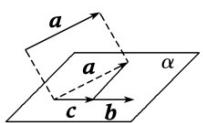
①

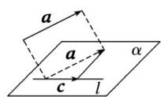

③

## 3. 空间向量数量积的性质

(1)若 $a, b$ 为非零向量，则 $a \perp b \Leftrightarrow a \cdot b = 0$ ；

(2) $a\cdot a=|a|^{2}$ 或 $|a|=$ = ;

(3)若 $a, b$ 为非零向量，则 $\cos \langle a, b \rangle =$ ;

(4) $|a\cdot b|\leq|a||b|$ (当且仅当a，b共线时等号成立).

## 【即学即练】

1．在三棱锥 P-ABC 中，PA，PB，PC 两两垂直，且 PA=PB=PC=4，D 为 AC 的中点，E 为 BC 的中点，

若 $M$ 为该三棱锥外接球上的一点，则 $\overrightarrow{MD} \cdot \overrightarrow{ME}$ 的最大值为（）A. $12 + 4\sqrt{3}$ B. $14 + 2\sqrt{3}$ C. $10 + 2\sqrt{6}$ D. $12 + 4\sqrt{6}$

【答案】D

【详解】

设三棱锥 $P - ABC$ 的外接球的球心为 $O$

∵ PA，PB，PC 两两垂直，且 PA = PB = PC = 4 ，则 AB = AC = BC = $4\sqrt{2}$

三棱锥 $P - ABC$ 的外接球的半径为 $\frac{1}{2}\sqrt{4^2 + 4^2 + 4^2} = 2\sqrt{3}$

$\because D$ 为 $AC$ 的中点， $E$ 为 $BC$ 的中点， $\therefore DE = \frac{1}{2} AB = 2\sqrt{2}$ ，设 $N$ 为 $DE$ 为中点，则

$$
D N = \sqrt {2} O D = 2 \therefore O N = \sqrt {O D ^ {2} - D N ^ {2}} = \sqrt {2}
$$

$$
\therefore M D \cdot M E = \left(M N + N D\right) \cdot \left(M N + N E\right)
$$

$$
= \left(\frac {\square \square \square}{M N} - \frac {1}{2} \frac {\square \square \square}{D E}\right) \cdot \left(\frac {\square \square \square}{M N} + \frac {1}{2} \frac {\square \square \square}{D E}\right) = \frac {\square \square \square^ {2}}{M N} - \frac {1}{4} \frac {\square \square \square^ {2}}{D E ^ {2}} = \frac {\square \square \square^ {2}}{M N} - 2
$$

$$
= \left| M N \right| ^ {2} - 2
$$

要使 $\overline{MD} \cdot \overline{ME}$ 取到最大值，则 $\left|\overline{MN}\right|$ 必须达到最大，则M、O、N三点要共线，

且满足 $\left|\overline{MN}\right| = \left|\overline{MO}\right| + \left|\overline{ON}\right| = 2\sqrt{3} +\sqrt{2}$ ，故 $\overline{MD}\cdot \overline{ME} = (2\sqrt{3} +\sqrt{2})^2 -2 = 12 + 4\sqrt{6}$

故选：D.

2．如图所示，平行六面体 $ABCD - A_1B_1C_1D_1$ 中， $AB = AD = 1$ ， $AA_{1} = 2$ ， $\angle BAD = \frac{\pi}{2}$ ， $\angle BAA_{1} = \angle DAA_{1} = \frac{\pi}{3}$

(1)求 $BD_{1}\cdot AC$ ;

(2)求 $AC_{1}$ 的长度.

【答案】(1)2

(2) $\sqrt{10}$

【详解】（1）在平行六面体 $ABCD - A_{1}B_{1}C_{1}D_{1}$ 中， $\overline{BD}_{1} = \overline{AD}_{1} - \overline{AB} = \overline{AA}_{1} + \overline{AD} - \overline{AB}$

因为 $AC = AB + AD$ ，AB = AD = 1， $AA_{1} = 2$ ， $\angle BAD = \frac{\pi}{2}$ ， $\angle BAA_{1} = \angle DAA_{1} = \frac{\pi}{3}$

所以 $\stackrel{uu}{AB} \cdot \stackrel{uu}{AD} = 0$ ， $\stackrel{UUU}{AA_{1}} \cdot \stackrel{UUU}{AB} = \left| \stackrel{UUU}{AA_{1}} \right| \cdot \left| \stackrel{UUU}{AB} \right| \cos \left\langle \stackrel{UUU}{AA_{1}}, \stackrel{UUU}{AB} \right\rangle = 2 \times 1 \times \cos \frac{\pi}{3} = 1$

$$
\stackrel {\text {   }} {A} \stackrel {\text {   }} {A} _ {1} \cdot \stackrel {\text {   }} {A} D = \left| \stackrel {\text {   }} {A} \stackrel {\text {   }} {A} _ {1} \right| \cdot \left| \stackrel {\text {   }} {A} D \right| \left\langle \cos \stackrel {\text {   }} {A} \stackrel {\text {   }} {A} _ {1}, \stackrel {\text {   }} {A} D \right\rangle = 2 \times 1 \times \cos \frac {\pi}{3} = 1,
$$

则 $BD_{1} \cdot AC = (AA_{1} + AD - AB) \cdot (AB + AD)$

$$
= A A _ {1} \cdot A B + A A _ {1} \cdot A D + A D \cdot A B + A D - A B - A B \cdot A D = 1 + 1 + 0 + 1 - 1 - 0 = 2
$$

(2) 因为 $AC_{1} = AB + BC + CC_{1} = AB + AD + AA_{1}$

所以 $AC_{1}^{2}=\left(AB+AD+AA_{1}\right)^{2}=AB^{2}+AD^{2}+AA_{1}^{2}$

$$
+ 2 A B \cdot A D + 2 A B \cdot A A _ {1} + 2 A D \cdot A A _ {1}
$$

$$
= 1 + 1 + 4 + 2 \times 0 + 2 \times 1 + 2 \times 1 = 1 0
$$

则 $\left|A C_{1}\right| = \sqrt{10}$

## 知识点 04 空间向量基本定理应用

1、证明平行、共面问题

(1)对于空间任意两个向量 $a$ ， $b(b\neq 0)$ ， $a\| b$ 的充要条件是存在实数 $\lambda$ ，使 $a = \lambda b$

(2) 如果两个向量 $a, b$ 不共线，那么向量 $p$ 与向量 $a, b$ 共面的充要条件是存在唯一的有序实数对 $(x, y)$ ，使 $p = xa + yb$ .

(3)直线平行和点共线都可以转化为向量共线问题；点线共面可以转化为向量共面问题。

2、求夹角、证明垂直问题

(1) $\theta$ 为 $a, b$ 的夹角，则 $\cos \theta =$ .

(2)若 $a, b$ 是非零向量，则 $a \perp b \Leftrightarrow a \cdot b = 0$ .

3、求距离(长度)问题

$= (\quad = \quad)$

【即学即练】

1．已知在三棱柱 $ABC-A_{1}B_{1}C_{1}$ 中， $AB=AC=2,AA_{1}=3,\angle A_{1}AB=\angle A_{1}AC=60^{\circ},\angle BAC=\alpha$ ，记 $AA_{1}=a$

$$
A B = b, A C = c
$$

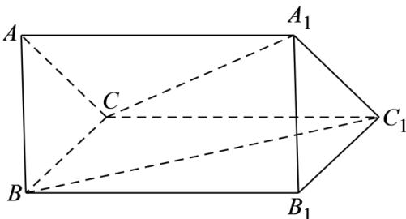

(1)求证：四边形 $BB_{1}C_{1}C$ 为矩形；

(2)若 $\alpha = 60^{\circ}$ ，求异面直线 $BC_{1}$ 与 $A_{1}C$ 所成角的余弦值.

【答案】(1)证明见解析

$$
4 \sqrt {9 1}
$$

(2) 91

【详解】（1）由已知该几何体是三棱柱 $ABC-A_{1}B_{1}C_{1}$

所以四边形 $BB_{1}C_{1}C$ 为平行四边形，

又 $BC = c - b, BB_{1} = AA_{1} = a$

所以 $BB_{1} \cdot BC = a \cdot (c - b) = a \cdot c - a \cdot b = 0$

故 $BC \perp BB_{1}$ ，即 $BB_{1} \perp BC$ .

所以四边形 $BB_{1}C_{1}C$ 为矩形.

(2) 由已知 $BC_{1} = BB_{1} + B_{1}C = AA_{1} + BC$

又 $BC = AC - AB = c - b$ ，故 $BC_{1} = a + c - b$

$$
\left| \overrightarrow {B C _ {1}} \right| = \sqrt {(a + c - b) ^ {2}} = \sqrt {a ^ {2} + c ^ {2} + b ^ {2} + 2 a \cdot c - 2 a \cdot b - 2 b \cdot c} = \sqrt {1 3},
$$

同理 $A_{1}C = c - a, \left|A_{1}C\right| = \sqrt{(c - a)^{2}} = \sqrt{a^{2} + c^{2} - 2a \cdot c} = \sqrt{7}$

$$
B C _ {1} \cdot A _ {1} C = (a + c - b) \cdot (c - a) = c ^ {2} - a ^ {2} - b \cdot c + a \cdot b = - 4
$$

$\cos B C_{1}, A_{1}C = \frac{B G_{1} \cdot A C}{|B C_{1}| \cdot |A_{1}C|} = \frac{-4}{\sqrt{13} \times \sqrt{7}} = -\frac{4\sqrt{91}}{91}$

$$
4 \sqrt {9 1}
$$

所以异面直线 $BC_{1}$ 与 $A_{1}C$ 所成角的余弦值为 91.

2．如图所示，平行六面体 $ABCD-A_{1}B_{1}C_{1}D_{1}$ 中，E，F 分别在 $B_{1}B$ 和 $D_{1}D$ 上， $BE=\frac{1}{3}BB_{1}$ ， $DF=\frac{2}{3}DD_{1}$

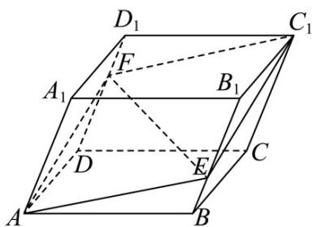

(1)求证： $A$ ， $E$ ， $C_1$ ， $F$ 四点共面；

(2)若 $EF = xAB + yAD + zAA_{1}$ ，求 $x + y + z$ 的值.

【答案】(1)证明见解析

(2) $\frac{1}{3}$

∵ $AC_{1} = AB + AD + AA_{1} = AB + AD + \frac{1}{3} AA_{1} + \frac{2}{3} AA_{1}$ 【详解】（1）证明：

$$
= \frac {\square \square \square}{A B} + \frac {1}{3} \frac {\square \square \square}{A A _ {1}} + \frac {\square \square \square}{A D} + \frac {2}{3} \frac {\square \square \square}{A A _ {1}} = \frac {\square \square \square}{A B} + \frac {1}{3} \frac {\square \square \square}{B B _ {1}} + \frac {\square \square \square}{A D} + \frac {2}{3} \frac {\square \square \square}{D D _ {1}}
$$

$$
= (A B + B E) + (A D + D F) = A E + A F
$$

$\therefore A, E, C_{1}, F$ 四点共面.

$$
\because E F = A F - A E = A D + D F - \left(A B + B E\right) \tag {2}
$$

$$
= A D + \frac {2}{3} D D _ {1} - A B - \frac {1}{3} B B _ {1} = - A B + A D + \frac {1}{3} A A _ {1}
$$

$$
\therefore x = - 1, y = 1, z = \frac {1}{3},
$$

$$
\therefore x + y + z = \frac {1}{3}.
$$

## 知识点 05 空间向量的坐标运算

## 1. 空间向量的坐标运算法则

设向量 $a = (a_{1}, a_{2}, a_{3})$ ， $b = (b_{1}, b_{2}, b_{3})$ ， $\lambda \in \mathbb{R}$ ，那么

<table><tr><td>向量运算</td><td>向量表示</td><td>坐标表示</td></tr><tr><td>加法</td><td>a + b</td><td> $(a_1 + b_1, a_2 + b_2, a_3 + b_3)$ </td></tr><tr><td>减法</td><td>a - b</td><td> $(a_1 - b_1, a_2 - b_2, a_3 - b_3)$ </td></tr><tr><td>数乘</td><td>λa</td><td> $(\lambda a_1, \lambda a_2, \lambda a_3)$ </td></tr><tr><td>数量积</td><td>a·b</td><td> $a_1b_1 + a_2b_2 + a_3b_3$ </td></tr></table>

注意点：

(1)空间向量运算的坐标表示与平面向量的坐标表示完全一致.

(2)设 $A(x_{1},y_{1},z_{1})$ ， $B(x_{2},y_{2},z_{2})$ ，则 $\mathbf{AB} = (x_2 - x_1,y_2 - y_1,z_2 - z_1)$ .即一个空间向量的坐标等于表示此向量的有向线段的终点坐标减去起点坐标.

(3)运用公式可以简化运算： $(a\pm b)^2 = a^2\pm 2a\cdot b + b^2$ ； $(a + b)\cdot (a - b) = a^2 -b^2.$

(4)向量线性运算的结果仍是向量，用坐标表示；数量积的结果为数量。

## 2. 空间向量相关结论的坐标表示

设 $a = (a_{1}, a_{2}, a_{3})$ ， $b = (b_{1}, b_{2}, b_{3})$ ，则有

(1)平行关系：当 $b \neq 0$ 时， $a \| b \Leftrightarrow a = \lambda b \Leftrightarrow a_1 = \lambda b_1$ ， $a_2 = \lambda b_2$ ， $a_3 = \lambda b_3 (\lambda \in \mathbf{R})$ ；

(2)垂直关系： $a_{\perp}b\Leftrightarrow a\cdot b=0\Leftrightarrow\underline{a_{1}b_{1}}+a_{2}\underline{b_{2}}+a_{3}\underline{b_{3}}=\underline{0}.$

(3)|a| = = .

(4)cos $\langle a, b \rangle = =$ .

## 3. 空间两点间的距离公式

在空间直角坐标系中，设 $P_{1}(x_{1},y_{1},z_{1})$ ， $P_{2}(x_{2},y_{2},z_{2})$ ：

(1)P1P2 = $(x_{2} - x_{1}, y_{2} - y_{1}, z_{2} - z_{1})$ .

(2) $P_{1}P_{2} = |\mathrm{P1P2}| = .$

(3)若 $O(0,0,0)$ , $P(x,y,z)$ , 则 $|\mathrm{OP}| = .$

## 【即学即练】

1．已知向量 $a=(1,x^{2},2)$ ， $b=(0,1,2)$ ， $c=(1,0,0)$ ，若 a,b,c 共面，则 x 等于（）

【答案】
A. -2 B. 1 C. ±1 D. ±2

【答案】C

【详解】因为向量 $a = (1, x^2, 2)$ ， $b = (0, 1, 2)$ ， $c = (1, 0, 0)$ ，且 $a, b, c$ 共面，

则存在实数 $m, n$ ，使得 $a = mb + nc$

即 $\left(1, x^2, 2\right) = m(0, 1, 2) + n(1, 0, 0) = (n, m, 2m)$

所以 $\left\{\begin{aligned}n=1\\ m=x^{2}\\ 2m=2\end{aligned}\right.$ ，解得 m=1

所以 $x^{2} = 1$ ，即 $x = \pm 1$

故选：C

2．已知空间中三点 $A(0,2,3)$ ， $B(-2,1,6)$ ， $C(1,-1,5)$ ，则以 AB，AC 为邻边的平行四边形的面积为

【答案】
() A. $\frac{3}{2}$ B. $7\sqrt{3}$ C.3 D. $3\sqrt{3}$

【答案】B

【详解】已知 $A(0,2,3)$ ， $B(-2,1,6)$ ， $C(1, - 1,5)$ ，根据向量坐标运算可得 $\overline{AB} = (-2 - 0,1 - 2,6 - 3) = (-2, - 1,3)$ ， $\overline{AC} = (1 - 0, - 1 - 2,5 - 3) = (1, - 3,2)$

根据向量数量积坐标运算：可得 $AB \cdot AC = (-2) \times 1 + (-1) \times (-3) + 3 \times 2 = -2 + 3 + 6 = 7$

根据向量模长公式：可得 $|AB| = \sqrt{(-2)^2 + (-1)^2 + 3^2} = \sqrt{4 + 1 + 9} = \sqrt{14}$

$$
\mid A C \mid = \sqrt {1 ^ {2} + (- 3) ^ {2} + 2 ^ {2}} = \sqrt {1 + 9 + 4} = \sqrt {1 4}
$$

根据向量夹角公式可得 $\cos\left\langle AB, AC\right\rangle = \frac{AB \cdot AC}{|AB| \times |AC|} = \frac{7}{\sqrt{14} \times \sqrt{14}} = \frac{7}{14} = \frac{1}{2}$ .

因为 $\sin\left\langle AB, AC\right\rangle = \sqrt{1 - \cos^{2}\left\langle AB, AC\right\rangle} = \sqrt{1 - \left(\frac{1}{2}\right)^{2}} = \sqrt{1 - \frac{1}{4}} = \frac{\sqrt{3}}{2}$

根据平行四边形面积公式 $S = |\overline{AB}| \times |\overline{AC}| \times \sin \langle \overline{AB}, \overline{AC}\rangle$ ，可得 $S = \sqrt{14} \times \sqrt{14} \times \frac{\sqrt{3}}{2} = 14 \times \frac{\sqrt{3}}{2} = 7\sqrt{3}$ .

则 AB, AC 邻边的平行四边形的面积为 $7\sqrt{3}$ .

故选：B.

知识点 06 空间平行、垂直关系的向量表示

<table><tr><td colspan="3">设u1,u2分别是直线l1,l2的方向向量,n1,n2分别是平面α,β的法向量.</td></tr><tr><td>线线平行</td><td>l1∥l2⇔u1∥u2⇔∃λ∈R,使得u1=λu2注:此处不考虑线线重合的情况.但用向量方法证明线线平行时,必须说明两直线不重合</td><td>证明线线平行的两种思路:1用基向量表示出要证明的两条直线的方向向量,通过向量的线性运算,利用向量共线的充要条件证明.2建立空间直角坐标系,通过坐标运算,利用向量平行的坐标表示.</td></tr><tr><td>线面平行</td><td>l1∥α⇔u1⊥n1⇔u1·n1=0注:证明线面平行时,必须说明直线不在平面内;</td><td>(1)证明线面平行的关键看直线的方向向量与平面的法向量垂直.(2)特别强调直线在平面外.</td></tr><tr><td>面面平行</td><td>α∥β⇔n1∥n2⇔∃λ∈R,使得n1=λn2注:证明面面平行时,必须说明两个平面不重合.</td><td>(1)利用空间向量证明面面平行,通常是证明两平面的法向量平行.(2)将面面平行转化为线线平行然后用向量共线进行证明.</td></tr><tr><td>线线垂直</td><td>l1⊥l2⇔u1⊥u2⇔u1·u2=0</td><td>(1)两直线垂直分为相交垂直和异面垂直,都可转化为两直线的方向向量相互垂直.(2)基向量法证明两直线垂直即证直线的方向向量相互垂直,坐标法证明两直线垂直即证两直线方向向量的数量积为0.</td></tr><tr><td>线面垂直</td><td>l1⊥α⇔u1∥n1⇔∃λ∈R,使得u1=λn1</td><td>(1)基向量法:选取基向量,用基向量表示直线所在的向量,证明直线所在向量与两个不共线向量的数量积均为零,从而证得结论.(2)坐标法:建立空间直角坐标系,求出直线方向向量的坐标,证明直线的方向向量与两个不共线向量的数量积均为零,从而证得结论.(3)法向量法:建立空间直角坐标系,求出直线方向向量的坐标以及平面法向量的坐标,然后说明直线方向向量与平面法向量共线,从而证得结论.</td></tr><tr><td>面面垂直</td><td> $\alpha \perp \beta \Leftrightarrow n_{1} \perp n_{2} \Leftrightarrow n_{1} \cdot n_{2} = 0$ </td><td>(1)常规法:利用面面垂直的判定定理转化为线面垂直、线线垂直去证明.(2)法向量法:证明两个平面的法向量互相垂直</td></tr></table>

## 【即学即练】

1. 已知平面 $\alpha$ 的法向量为 $n = (x, 1, -2)$ ，平面 $\beta$ 的法向量为 $\stackrel{\square}{m} = (-1, y, \frac{1}{2})$ ，若 $\alpha \parallel \beta$ ，则 $x - y = (\quad)$ A. $\frac{5}{2}$ B. $\frac{17}{4}$ C. 3 D. $\frac{15}{4}$

【答案】B

【详解】因为 $\alpha / / \beta$ ，所以 $n / / m$

所以 $\frac{x}{-1} = \frac{1}{y} = \frac{-2}{\frac{1}{2}} = -4$

所以 $x = 4, y = -\frac{1}{4}$

所以 $x - y = \frac{17}{4}$

故选：B

2．如图，正方体 $ABCD-A_{1}B_{1}C_{1}D_{1}$ 中，E,F 分别是 $BC,AA_{1}$ 上的中点，P 是 $A_{1}C_{1}$ 上的动点.下列结论错误的是

【答案】

( )

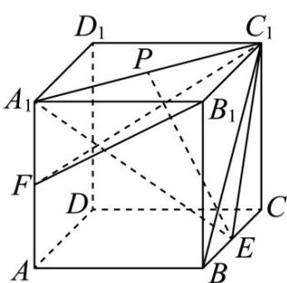

A. 平面 $A_{1}C_{1}E$ 截正方体所得截面为等腰梯形
B. 平面 $B_{1}FC_{1} \perp$ 平面 $A_{1}C_{1}E$ C. 存在点 $P$ ，使得 $EP //$ 平面 $AA_{1}B_{1}B$ D. 存在点 $P$ ，使得 $DB_{1} \perp EP$

【答案】D

【详解】对于 A，取 AB 的中点为 H，连接 $EH, A_{1}H$ ，如下图所示：

由中位线性质可得 $EH \parallel AC$ ，显然 $AC \parallel A_{1}C_{1}$ ，所以 $EH \parallel A_{1}C_{1}$ ，

即可得 $E, H, A_{1}, C_{1}$ 四点共面，即四边形 $EHA_{1}C_{1}$ 即为平面 $A_{1}C_{1}E$ 截正方体所得截面，

易知 $HA_{1} = EC_{1}$ ，所以四边形 $EHA_{1}C_{1}$ 为等腰梯形，即 A 正确；

对于 B，以 D 为坐标原点， $DA, DC, DD_{1}$ 分别为 x, y, z 轴建立空间直角坐标系，如下图所示：

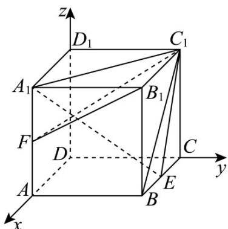

设正方体的棱长为 2，可得 $B_{1}(2,2,2)$ , $F(2,0,1)$ , $C_{1}(0,2,2)$ , $A_{1}(2,0,2)$ , $E(1,2,0)$

易知 $B_{1}F = (0, - 2, - 1),B_{1}C_{1} = (-2,0,0)$

设平面 $B_{1}FC_{1}$ 的一个法向量为 $m = (x_{1},y_{1},z_{1})$

可得 $\left\{ \begin{array}{l} B_{1}E \cdot m = -2y_{1} - z_{1} = 0 \\ B_{1}C_{1} \cdot m = -2x_{1} = 0 \end{array} \right.$ ，解得 $x_{1} = 0$ ，令 $y_{1} = 1$ ，可得 $z_{1} = -2$ ；

所以 $m = (0,1,-2)$

易知 $C_{1}E = (1,0, - 2),A_{1}C_{1} = (-2,2,0)$

设平面 $A_{1}C_{1}E$ 的一个法向量为 $n=(x_{2},y_{2},z_{2})$

可得 $\left\{ \begin{array}{l} C_1E \cdot n = x_1 - 2z_1 = 0 \\ A_1C_1 \cdot n = -2x_1 + 2y_1 = 0 \end{array} \right.$ ，解得 $x_1 = 2$ ，可得 $y_1 = 2$ ， $z_1 = 1$ ；

所以 $n = (2,2,1)$

显然 $\stackrel{\cup}{m}\cdot n=0$ ，即 $\stackrel{\cup}{m}\perp n$ ，所以平面 $B_{1}FC_{1}\perp$ 平面 $A_{1}C_{1}E$ ，即 B 正确；

对于 C，取 $A_{1}B_{1}$ 的中点为 Q，连接 PQ, BQ，如下图所示：

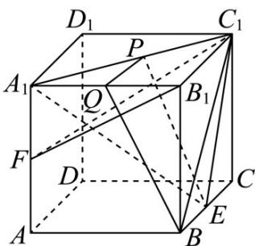

当 $P$ 为 $A_{1}C_{1}$ 的中点时，可得 $PQ / / B_{1}C_{1}$ ，且 $PQ = \frac{1}{2} B_{1}C_{1}$

又 $BE / / B_{1}C_{1}$ 且 $BE = \frac{1}{2} B_{1}C_{1} = \frac{1}{2} BC$ ，可得 $PQ / / BE, PQ = BE$

即四边形 PQBE 为平行四边形，可得 BQ // EP ，

又 $BQ \subset$ 平面 $AA_{1}B_{1}B$ ， $EP \not\subset$ 平面 $AA_{1}B_{1}B$ ，即 $EP \parallel$ 平面 $AA_{1}B_{1}B$ ；

所以存在点 P 为 $A_{1}C_{1}$ 的中点时，使得 $EP \parallel$ 平面 $AA_{1}B_{1}B$ ，可得 C 正确；

对于 D，由 B 选项中空间直角坐标系如下图所示：

可得 $D(0,0,0)$ , $B_{1}(2,2,2)$ , $E(1,2,0)$ ，即 $DB_{1}=(2,2,2)$

设 $\overset{\square\square}{A_{1}}P=\lambda\overset{\square\square}{A_{1}}C_{1}=(-2\lambda,2\lambda,0),\lambda\in[0,1]$ ，则 $\overset{\square\square}{E}P=\overset{\square\square}{E}A_{1}+\overset{\square\square}{A_{1}}P=(1,-2,2)+(-2\lambda,2\lambda,0)=(1-2\lambda,-2+2\lambda,2)$

此时 $\overline{DB_{1}}\cdot\overline{EP}=2(1-2\lambda-2+2\lambda+2)=2\neq0$ ，即 $\overline{DB_{1}}\perp\overline{EP}$ 不成立；

所以不存在点 P，使得 $DB_{1} \perp EP$ ，即 D 错误.

故选：D

知识点 07 空间距离及向量求法

<table><tr><td>分类</td><td>点到直线的距离</td><td>点到平面的距离</td></tr><tr><td>图形语言</td><td>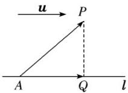</td><td>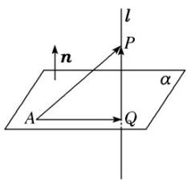</td></tr><tr><td>文字语言</td><td>设u为直线l的单位方向向量,A∈l,P∉l,AP=a,向量AP在直线l上的投影向量为AQ(AQ=(a·u)u.),则PQ=APAQ=</td><td>设已知平面α的法向量为n,A∈α,P∉α,向量AQ是向量AP在平面上的投影向量,PQ=AP=AP注:实质上,n是直线l的方向向量,点P到平面α的距离就是AP在直线l上的投影向量QP的长度.</td></tr></table>

## 【即学即练】

1．已知 $A(1,0,1)$ ， $B\left(1,\frac{1}{2},0\right)$ ， $C(0,1,0)$ ， $M\left(1,\frac{1}{2},1\right)$ ， $N(0,1,1)$ ，则直线MN到平面ABC的距离为（）A. $\sqrt{6}$ B. $\frac{\sqrt{6}}{4}$ C. $\frac{\sqrt{6}}{12}$ D. $\frac{\sqrt{6}}{6}$

【答案】D

【详解】 $AB = \left(0, \frac{1}{2}, -1\right)$ ， $BC = \left(-1, \frac{1}{2}, 0\right)$ ， $AM = \left(0, \frac{1}{2}, 0\right)$ ， $MN = \left(-1, \frac{1}{2}, 0\right)$

显然 $MN = BC$ ，所以 $MN / / BC$

而 $MN \notin$ 平面 $ABC$ ， $BC \subset$ 平面 $ABC$ ，于是 $MN //$ 平面 $ABC$

因此直线 $MN$ 到平面 $ABC$ 的距离等于点 $M$ 到平面 $ABC$ 的距离.

设平面 的法向量为 $n = (x,y,z)$ ，则 $\left\{ \begin{array}{ll} \vec{n} & \vec{AB} = \frac{1}{2} y - z = 0 \\ \vec{n} & \vec{BC} = -x + \frac{1}{2} y = 0 \\ n & z = 1 \end{array} \right.$ ，令，得所以点 $M$ 到平面 $ABC$ 的距离为 $\frac{\left|\overrightarrow{AM} \cdot n\right|}{\left|n\right|} = \frac{1}{\sqrt{6}} = \frac{\sqrt{6}}{6}$

所以直线 MN 到平面 ABC 的距离是 $\frac{\sqrt{6}}{6}$

故选：D

2. 如图，在直三棱柱 $ABC - A_{1}B_{1}C_{1}$ 中， $\angle ACB = \frac{\pi}{2}$ ， $AC = 2$ ， $BC = 1$ ， $AA_{1} = 2$ ，点 $D$ 是棱 $AC$ 的中点，点 $E$ 在棱 $BB_{1}$ 上运动，则点 $D$ 到直线 $C_{1}E$ 的距离的最小值为（）

【答案】

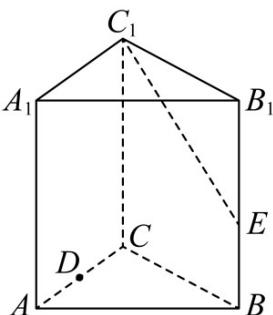

A. $\frac{2\sqrt{5}}{5}$ B. $\frac{4\sqrt{5}}{5}$ C. $\sqrt{5}$ D. $\frac{3\sqrt{5}}{5}$

【答案】D

【详解】因为 $CC_{1} \perp$ 平面 ABC ， $\angle ACB = \frac{\pi}{2}$

所以以 C 为原点，CA, CB, CC $_{1}$ 所在直线分别为 x, y, z 轴建立如图所示的空间直角坐标系，

连接 $C_1D$ ，则 $D(1,0,0)$ ， $C_1(0,0,2)$ ，设 $E(0,1,c)$ ，其中 $0\leq c\leq 2$

所以 $C_{1}D=(1,0,-2)$ ， $C_{1}E=(0,1,c-2)$ ，则点 D 到直线 $C_{1}E$ 的距离：

$$
d = \sqrt {\left| \square \square \square \vec {C} _ {1} D \right| ^ {2} - \left(\frac {\square \square \square \square \square \square \square \square}{\left| C _ {1} E \right|}\right) ^ {2}} = \sqrt {5 - \left[ \frac {- 2 (c - 2)}{\sqrt {(c - 2) ^ {2} + 1}} \right] ^ {2}} = \sqrt {5 - \frac {4 (c - 2) ^ {2}}{(c - 2) ^ {2} + 1}} = \sqrt {1 + \frac {4}{(c - 2) ^ {2} + 1}}
$$

设 $t = (c - 2)^{2} + 1$ ，因为 $c\in [0,2]$ ，所以 $t\in [1,5]$ ，则 $d = \sqrt{1 + \frac{4}{t}}\in \left[\frac{3\sqrt{5}}{5},\sqrt{5}\right].$

所以点 $D$ 到直线 $C_1E$ 的距离的最小值为 $\frac{3\sqrt{5}}{5}$

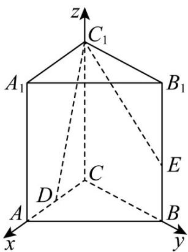

故选：D

知识点 08 空间角及向量求法

<table><tr><td>角的分类</td><td>向量求法</td><td>范围</td></tr><tr><td>异面直线所成的角</td><td>设两异面直线所成的角为θ,两直线的方向向量分别为u,v,则 $\cos \theta = |\cos \langle u, v \rangle| =$ </td><td>(1)两异面直线所成角的范围是(2)两异面直线所成的角与其方向向量的夹角是相等或互补的关系.</td></tr><tr><td>直线与平面所成的角</td><td>设直线1与平面α所成的角为θ,1的方向向量为u,平面α的法向量为n,则 $\sin \theta = |\cos \langle u, n \rangle| =$ </td><td>(1)线面角的范围为.(2)直线与平面所成的角等于其方向向量与平面法向量所成锐角的余角.</td></tr><tr><td>两平面的夹角</td><td>平面α与平面β相交,形成四个二面角,把不大于的二面角称为这两个平面的夹角.设平面α与平面β的夹角为θ,两平面 $\alpha$ , $\beta$ 的法向量分别为 $n_1$ , $n_2$ ,则 $\cos\theta = |\cos\langle n_1, n_2\rangle| =$ </td><td>(1)两个平面的夹角的范围是(2)两平面的夹角是两法向量的夹角或其补角.</td></tr></table>

【即学即练】

1．如图，三棱锥 A-BCD 中，AB=BC=AC=DB=DC，且平面 ABC 与底面 BCD 垂直，E 为 BC 中点， $EF = DA$ ，则平面 ADB 与平面 ABF 夹角的余弦值为（）

【答案】

A. $\frac{\sqrt{5}}{5}$ B. $\frac{2\sqrt{5}}{5}$ C. $\frac{\sqrt{6}}{3}$ D. 1

【答案】B

【详解】如图，连接 $AE, DE$

因为 AB = BC = AC = DB = DC, E 为 BC 中点，

所以 $AE \perp BC, DE \perp BC$

又平面 $ABC \perp$ 底面 $BCD$ ，平面 $ABC \cap$ 底面 $BCD = BC, AE \subset$ 平面 $ABC$

所以 $AE \perp$ 平面 BCD ，故 ED, EB, EA 两两垂直，

以 E 为坐标原点，建立如图所示的空间直角坐标系，

设 AB = 2 ，由 $EF = DA$ ，

可得 $A(0,0,\sqrt{3}), D(\sqrt{3},0,0), B(0,1,0), F(-\sqrt{3},0,\sqrt{3})$

则 $AB = (0,1, - \sqrt{3}),\overline{AD} = (\sqrt{3},0, - \sqrt{3}),\overline{AF} = (- \sqrt{3},0,0)$

设平面 $ABD$ 的一个法向量为 $m = (x, y, z)$

则有 $\left\{ \begin{array}{l}m\cdot AB = y - \sqrt{3} z = 0\\ \rightarrow \\ m\cdot AD = \sqrt{3} x - \sqrt{3} z = 0 \end{array} \right.$ ，令 $x = 1$ ，得 $y = \sqrt{3},z = 1$ ，则 $m = (1,\sqrt{3},1)$

设平面 $ABF$ 的一个法向量为 $n = (a, b, c)$

则有 $\left\{ \begin{array}{l} n \cdot AB = b - \sqrt{3}c = 0 \\ n \cdot AF = -\sqrt{3}a = 0 \end{array} \right.$ ，令 $c = 1$ ，得 $a = 0, b = \sqrt{3}$ ，得 $n = (0, \sqrt{3}, 1)$ ，

则 $\cos\langle m,n\rangle=\frac{m\cdot n}{|m||n|}=\frac{4}{2\times\sqrt{5}}=\frac{2\sqrt{5}}{5}$

则平面 $ADB$ 与平面 $ABF$ 夹角的余弦值为 $\frac{2\sqrt{5}}{5}$

故选：B.

2．在《九章算术》中，将四个面都是直角三角形的四面体称为“鳖臑”，在鳖臑 A-BCD 中， $AB \perp$ 平面 BCD

且 $AB = BC = CD = 2$ ， $M$ 为 $AD$ 中点， $N$ 为 $CD$ 中点，则直线 $CM$ 与平面 $ABN$ 所成角的余弦值为（）

A. $\frac{\sqrt{2}}{4}$ B. $\frac{1}{3}$ C. $\frac{\sqrt{15}}{5}$ D. $\frac{\sqrt{10}}{5}$

【答案】D

【详解】由题可知 $AB, BC, CD$ 两两垂直，且 $AB = BC = CD = 2$

因此，如图所示正方体内的三棱锥 A-BCD 即为满足题意的鳖臑 A-BCD

以 $B$ 为原点，建立如图所示的空间直角坐标系，正方体棱长为2，

则 $B(0,0,0)$ ， $A(0,0,2)$ ， $C(0,2,0)$ ， $M(1,1,1)$ ， $N(1,2,0)$ ，则 $\overline{CM} = (1, -1, 1)$ ， $\overline{BA} = (0, 0, 2)$ ， $\overline{BN} = (1, 2, 0)$

设平面 $ABN$ 的法向量为 $n = (x, y, z)$

则 $\left\{ \begin{array}{l} B A \cdot n = 0, \\ B N \cdot n = 0, \end{array} \right.$ 即 $\left\{ \begin{array}{l} 2 z = 0, \\ x + 2 y = 0, \end{array} \right.$

故可取 $n = (2, -1, 0)$ 。设直线 $CM$ 与平面 $ABN$ 所成角为 $\theta$

则 $\sin\theta=\frac{\left|\begin{matrix}CM\\CM\end{matrix}\cdot n\end{matrix}\right|}{\left|\begin{matrix}CM\\CM\end{matrix}\right|\cdot\left|n\right|}=\frac{3}{\sqrt{3}\times\sqrt{5}}=\frac{\sqrt{15}}{5}$ ，故 $\cos\theta=\sqrt{1-\left(\frac{\sqrt{15}}{5}\right)^{2}}=\frac{\sqrt{10}}{5}$ ，

故选：D.

## 题型精讲

![[高中/课堂同步/题库/人教A版高中数学同步讲义(2026)/03_选择性必修第一册/第一章 空间向量与立体几何/第一章 空间向量与立体几何（高效培优讲义）/题型01_空间向量的线性运算/题型01_空间向量的线性运算.md]]
![[高中/课堂同步/题库/人教A版高中数学同步讲义(2026)/03_选择性必修第一册/第一章 空间向量与立体几何/第一章 空间向量与立体几何（高效培优讲义）/题型02_空间共线向量定理/题型02_空间共线向量定理.md]]
![[高中/课堂同步/题库/人教A版高中数学同步讲义(2026)/03_选择性必修第一册/第一章 空间向量与立体几何/第一章 空间向量与立体几何（高效培优讲义）/题型03_空间共面向量定理/题型03_空间共面向量定理.md]]
![[高中/课堂同步/题库/人教A版高中数学同步讲义(2026)/03_选择性必修第一册/第一章 空间向量与立体几何/第一章 空间向量与立体几何（高效培优讲义）/题型04_空间向量的数量积及其性质的应用/题型04_空间向量的数量积及其性质的应用.md]]
![[高中/课堂同步/题库/人教A版高中数学同步讲义(2026)/03_选择性必修第一册/第一章 空间向量与立体几何/第一章 空间向量与立体几何（高效培优讲义）/题型05_空间向量在立体几何平行_垂直问题中的应用/题型05_空间向量在立体几何平行_垂直问题中的应用.md]]
![[高中/课堂同步/题库/人教A版高中数学同步讲义(2026)/03_选择性必修第一册/第一章 空间向量与立体几何/第一章 空间向量与立体几何（高效培优讲义）/题型06_空间角的计算/题型06_空间角的计算.md]]
![[高中/课堂同步/题库/人教A版高中数学同步讲义(2026)/03_选择性必修第一册/第一章 空间向量与立体几何/第一章 空间向量与立体几何（高效培优讲义）/题型07_空间距离的计算/题型07_空间距离的计算.md]]
![[高中/课堂同步/题库/人教A版高中数学同步讲义(2026)/03_选择性必修第一册/第一章 空间向量与立体几何/第一章 空间向量与立体几何（高效培优讲义）/题型08_空间向量与立体几何的综合问题/题型08_空间向量与立体几何的综合问题.md]]
![[高中/课堂同步/题库/人教A版高中数学同步讲义(2026)/03_选择性必修第一册/第一章 空间向量与立体几何/第一章 空间向量与立体几何（高效培优讲义）/强化训练/强化训练.md]]
