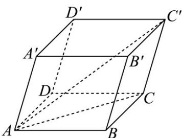

<!-- question-source:start -->
9．如图所示，在平行六面体 $ABCD-A'B'C'D'$ 中，AB=AD=2， $AA'=3$ ， $\angle BAD=45^{\circ}$

$$
\angle B A A ^ {\prime} = \angle D A A ^ {\prime} = 6 0 ^ {\circ}
$$

(1)求 $BB'\cdot AC'$ ;

(2)求线段 $AC'$ 的长.
<!-- question-source:end -->

![[高中/课堂同步/题库/人教A版高中数学同步讲义(2026)/03_选择性必修第一册/第一章 空间向量与立体几何/第一章 空间向量与立体几何（高效培优讲义）/强化训练/questions/answers/Q00080009A1.md]]
