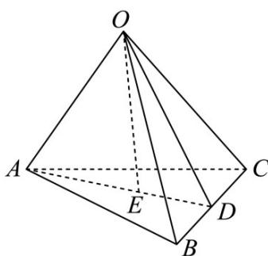

<!-- question-source:start -->
10．如图，在三棱锥 O-ABC 中，点 D 为 BC 的中点， $\frac{AE}{3}\frac{AD}{3}$ ，设 $OA = a, OB = b, OC = c$

(1)试用向量a,b,c表示向量 $OE$ ;

(2)若 $OA = OB = OC$ ，且 $\angle AOB = \angle BOC = \angle AOC = 90^{\circ}$ ，求证： $OE\perp$ 平面 $ABC$
<!-- question-source:end -->

![[高中/课堂同步/题库/人教A版高中数学同步讲义(2026)/03_选择性必修第一册/第一章 空间向量与立体几何/第一章 空间向量与立体几何（高效培优讲义）/强化训练/questions/answers/Q00080010A1.md]]
