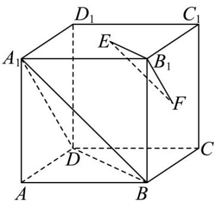

<!-- question-source:start -->
12．如图，在正方体 $ABCD-A_{1}B_{1}C_{1}D_{1}$ 中，E,F 分别为底面 $A_{1}B_{1}C_{1}D_{1}$ 和侧面 $BCC_{1}B_{1}$ 的中心．求证：

(1) $EF \parallel$ 平面 $A_{1}BD$ ;

(2)平面 $B_{1}EF //$ 平面 $A_{1}BD$
<!-- question-source:end -->

![[高中/课堂同步/题库/人教A版高中数学同步讲义(2026)/03_选择性必修第一册/第一章 空间向量与立体几何/第一章 空间向量与立体几何（高效培优讲义）/强化训练/questions/answers/Q00080012A1.md]]
