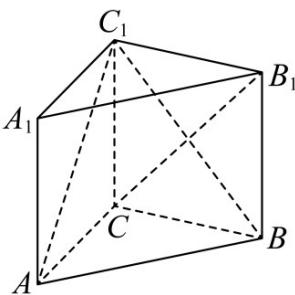

<!-- question-source:start -->
14. 如图，已知在直三棱柱 $ABC - A_{1}B_{1}C_{1}$ 中， $AC = 3$ ， $BC = 4$ ， $AB = 5$ ， $AA_{1} = 4$

(1)在线段 $AB$ 上是否存在点 $D$ ，使得 $AC_{1} \perp CD?$

(2)在线段 $AB$ 上是否存在点 $E$ ，使得 $AC_{1} //$ 平面 $CEB_{1}$ ? 说明理由。
<!-- question-source:end -->

![[高中/课堂同步/题库/人教A版高中数学同步讲义(2026)/03_选择性必修第一册/第一章 空间向量与立体几何/第一章 空间向量与立体几何（高效培优讲义）/强化训练/questions/answers/Q00080014A1.md]]
