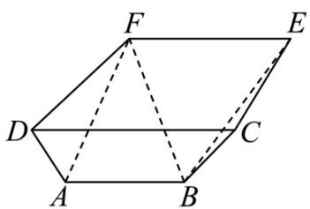
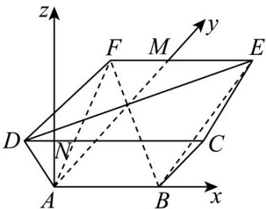

> [!faq]- 《第一章 空间向量与立体几何（高效培优讲义）》官方解析
>
> > [!success]- **【答案】** B
>
> > [!note]- **【解析】**
> > 由 $\overline{EA}-\lambda\overline{EA}=\frac{1}{3}\overline{EB}+\frac{1}{4}\overline{EC}+\lambda\overline{AD}$ 得 $\overline{EA}=\frac{1}{3}\overline{EB}+\frac{1}{4}\overline{EC}+\lambda\left(\overline{EA}+\overline{AD}\right)$
> >
> > 即 $\overline{EA}=\frac{1}{3}\overline{EB}+\frac{1}{4}\overline{EC}+\lambda\overline{ED}$
> >
> > 由空间向量共面定理的推论可知， $\frac{1}{3}+\frac{1}{4}+\lambda=1$ ，解得 $\lambda=\frac{5}{12}$
> >
> > 故选：B.
> >
> > 3．《九章算术》第五卷中涉及到一种几何体——羡除，它下广六尺，上广一丈·深三尺，末广八尺，袤七尺
> >
> > 该羡除是一个多面体 ABCDFE，如图，四边形 ABCD, ABEF，均为等腰梯形， $AB \parallel CD \parallel EF$ ，平面 $ABCD \perp$
> >
> > 平面 $ABEF$ ，梯形 $ABCD$ ，梯形 $ABEF$ 的高分别为3，7，且 $AB = 6$ ， $CD = 10$ ， $EF = 8$ ，则 $\overline{AD} \cdot \overline{BF} =$
> >
> > 
> >
> > A. -11 B. $7\sqrt{3}$ C. 14 D. 17
> >
> > 【答案】C
> >
> > 【详解】过A分别作CD，EF的高，垂足分别为N，M，
> >
> > 因为平面 $ABCD \perp$ 平面 $ABEF$ ， $AB//CD//EF$ ，
> >
> > 且平面 $ABCD \cap$ 平面 ABEF = AB ，所以 $NA \perp$ 平面 ABEF ，
> >
> > 因为 $AB \subset$ 平面 ABEF ， $AM \subset$ 平面 ABEF ，
> >
> > 所以 $AN \perp AB$ ， $AN \perp AM$ ，又 $AM \perp AB$ ，故 $AN$ ， $AB$ ， $AM$ 两两垂直，
> >
> > 以 A 为坐标原点， $AB$ ， $AM$ ， $AN$ 分别为 x，y，z 轴的正方向，
> >
> > 建立空间直角坐标系 A - xyz ，
> >
> > 
> >
> > 则由题意可知 $B(6,0,0)$ ， $D(-2,0,3)$ ， $F(-1,7,0)$ ， $A(0,0,0)$ ，
> >
> > 故 $\overline{BF}=(-7,7,0)$ ， $\overline{AD}=(-2,0,3)$ ，故 $AD\cdot\overline{BF}=14$
> >
> > 故选 **C**
