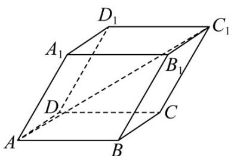

> [!faq]- 《第一章 空间向量与立体几何（高效培优讲义）》官方解析
>
> > [!success]- **【答案】**  A. $\frac{\sqrt{3}}{3}$ B. $\frac{\sqrt{3}}{2}$ C. $\frac{\sqrt{6}}{3}$ D. $\frac{\sqrt{6}}{2}$
>
> > [!note]- **【解析】**
> > 在平行六面体 $ABCD - A_{1}B_{1}C_{1}D_{1}$ 中， $AC_{1} = AB + BC + CC_{1} = AB + AD + AA_{1}$ ， $BB_{1}=AA_{1}$ ，记 $AB=AD=AA_{1}=a,\quad\angle A_{1}AB=\angle A_{1}AD=\angle BAD=60^{\circ}$
> >
> > 则 $\overrightarrow{AB} \cdot \overrightarrow{AD} = \overrightarrow{AD} \cdot \overrightarrow{AA_1} = \overrightarrow{AA_1} \cdot \overrightarrow{AB} = a \times a \cos 60^\circ = \frac{a^2}{2}$
> >
> > $$
> > \left| \begin{array}{c} \square \square \square \\ A C _ {1} \end{array} \right| = \sqrt {\left(A B + A D + A A _ {1}\right) ^ {2}} = \sqrt {\square \square \square^ {2} + A D ^ {2} + A A _ {1} ^ {2} + 2 A B \cdot A D + 2 A D \cdot A A _ {1} + 2 A A _ {1} \cdot A B}
> > $$
> >
> > $$
> > = \sqrt {a ^ {2} + a ^ {2} + a ^ {2} + 2 \times \frac {a ^ {2}}{2} + 2 \times \frac {a ^ {2}}{2} + 2 \times \frac {a ^ {2}}{2}} = \sqrt {6} a, | B B _ {1} | = a
> > $$
> >
> > $$
> > A C _ {1} \cdot B B _ {1} = (A B + A D + A A _ {1}) \cdot A A _ {1} = A B \cdot A A _ {1} + A D \cdot A A _ {1} + A A _ {1} ^ {2} = \frac {a ^ {2}}{2} + \frac {a ^ {2}}{2} + a ^ {2} = 2 a ^ {2}
> > $$
> >
> > 因此 $\cos \langle AC_1, BB_1 \rangle = \frac{AC_1 \cdot BB_1}{\left|AC_1\right|\left|BB_1\right|} = \frac{2a^2}{\sqrt{6}a \cdot a} = \frac{\sqrt{6}}{3}$
> >
> > 所以直线 $AC_{1}$ 与 $BB_{1}$ 所成角的余弦值为 $\frac{\sqrt{6}}{3}$
> >
> > 故选 **C**
