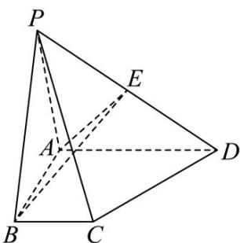

> [!faq]- 《第一章 空间向量与立体几何（高效培优讲义）》官方解析
>
> > [!success]- **【答案】**  A. $\frac{5}{12}$ B. $\frac{1}{2}$ C. $\frac{2}{3}$ D. $\frac{3}{4}$
>
> > [!note]- **【解析】**
> > 选择 $\left\{ \begin{array}{lll} \square & \square & \square \\ PA, AB, AD \end{array} \right\}$ 作为基底， $PC = PA + AB + BC = PA + AB + \frac{1}{2} AD$
> >
> > $PF = PA + AF$ ，由已知 F 点在平面 $ABE$ 内，即 $AF$ 与 $AB$ ， $AE$ 共面，可得 $AF = mAB + nAE$
> >
> > 又由 $E$ 是 $PD$ 的中点，可得 $\overline{AE} = \frac{1}{2}\overline{AP} +\frac{1}{2}\overline{AD}$ ，代换可得：
> >
> > $$
> > P F = (1 - \frac {1}{2} n) P A + m A B + \frac {1}{2} n A D
> > $$
> >
> > $\overline{PF}$ 与 $\overline{PC}$ 共线，即 $\overline{PF}=\lambda\overline{PC}$ ，可得： $\overline{PF}=\lambda PA+\lambda AB+\frac{1}{2}\lambda AD$ ，即 $\left\{\begin{aligned}\lambda&=1-\frac{1}{2}n\\ \lambda&m\end{aligned}\right.$ ，解得 $\frac{1}{2}\lambda=\frac{1}{2}n$ $\lambda=m=n=\frac{2}{3}$
> >
> > 故选 **C**
