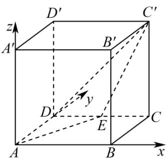

> [!faq]- 《第一章 空间向量与立体几何（高效培优讲义）》官方解析
>
> > [!success]- **【答案】**  A. $\frac{\sqrt{2}}{3}$ B. $\frac{\sqrt{5}}{3}$ C. $\frac{\sqrt{3}}{3}$ D. $\frac{\sqrt{6}}{3}$
>
> > [!note]- **【解析】**
> > 分别以 $AB$ ， $AD$ ， $AA'$ 为 $x$ 轴、 $y$ 轴、 $z$ 轴正方向建立空间直角坐标系，
> >
> > 
> >
> > 则 $A(0,0,0)$ ， $E\left(\frac{1}{2},1,0\right)$ ， $C^{\prime}(1,1,1)$ ， $D^{\prime}(0,1,1)$
> >
> > $AE=\left(\frac{1}{2},1,0\right)$ $AC'=(1,1,1)$
> >
> > 设平面 $AEC'$ 的一个法向量 $n = (x, y, z)$ ，由 $\left\{ \begin{array}{l} AE \cdot n = 0, \\ AC' \cdot n = 0, \end{array} \right.$ ，得 $\left\{ \begin{array}{l} \frac{1}{2} x + y = 0 \\ x + y + z = 0 \end{array} \right.$ ，取 $y = 1$ ，得 $n = (-2, 1, 1)$ ，
> >
> > 又 $D^{\prime}C^{\prime} = (1,0,0)$
> >
> > 点 $D^{\Phi}$ 到平面 $AEC'$ 的距离为 $\frac{\left|n\cdot D'C'\right|}{\left|n\right|} = \frac{\sqrt{6}}{3}$
> >
> > 故选 **D**.
