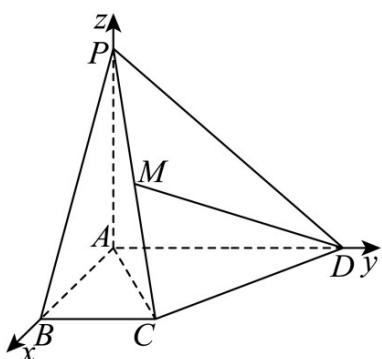

> [!faq]- 《第一章 空间向量与立体几何（高效培优讲义）》官方解析
>
> > [!success]- **【答案】** (1)证明见解析 (2) $\frac{\sqrt{17}}{2}$ (3) $\frac{\sqrt{10}}{10}$
>
> > [!note]- **【解析】**
> > （1）法1，结合题图， $PB = AB - AP,$ $DM = \frac{1}{2}\left(DP + DC\right) = \frac{1}{2}\left(AP - AD + AB - \frac{1}{2}AD\right)$
> >
> > $$
> > = \frac {1}{2} A P + \frac {1}{2} A B - \frac {3}{4} A D
> > $$
> >
> > 由题 $AB \cdot AD = AP \cdot AB = AP \cdot AD = 0$ ， $\left|AB\right| = \left|AP\right|$
> >
> > $$
> > \text {则} \quad P B \cdot D M = \left(A B - A P\right) \cdot \left(\frac {1}{2} A P + \frac {1}{2} A B - \frac {3}{4} A D\right) = \frac {1}{2} | A B | ^ {2} - \frac {1}{2} | A P | ^ {2} = 0
> > $$
> >
> > 所以 $PB \perp DM$ ，即 $PB \perp DM$ ；
> >
> > 法2，以 $A$ 为坐标原点， $\overline{AB}, \overline{AD}, \overline{AP}$ 的方向分别为 $x, y, z$ 轴的正方向建立如图所示的空间直角坐标系，则 $P(0,0,2), B(2,0,0), D(0,2,0), A(0,0,0), C(2,1,0)$ .
> >
> > 因为 M 为 PC 的中点，所以 $M\left(1,\frac{1}{2},1\right)$ ，所以 $PB=\left(2,0,-2\right)$ ， $DM=\left(1,-\frac{3}{2},1\right)$ ，
> >
> > 又 $\begin{array}{l}\square \square \square \square \\ PB\cdot DM = 2\times 1 + 0\times \left(-\frac{3}{2}\right) + (-2)\times 1 = 0\\ \end{array}$ ，所以 $PB\perp DM$ ，即 $PB\perp DM$ ；
> >
> > $$
> > D M = A M - A D = \frac {1}{2} A P + \frac {1}{2} A C - A D \quad A C = A B + B C = A B + \frac {1}{2} A D \quad D M = \frac {1}{2} A P + \frac {1}{2} A B - \frac {3}{4} A D
> > $$
> >
> > 从而
> >
> > $$
> > D M ^ {2} = \left(\frac {1}{2} A P + \frac {1}{2} A B - \frac {3}{4} A D\right) ^ {2} = \frac {1}{4} A P ^ {2} + \frac {1}{4} A B ^ {2} + \frac {9}{1 6} A D ^ {2} + \frac {1}{2} A P \cdot A B - \frac {3}{4} A P \cdot A D
> > $$
> >
> > $-\frac{3}{4}AB \cdot AD = \frac{1}{4} \times 4 + \frac{1}{4} \times 4 + \frac{9}{16} \times 4 + 0 - 0 = 2 + \frac{9}{4} = \frac{17}{4}$ ，则 $\left|DM\right| = \frac{\sqrt{17}}{2}$ ，即 $DM$ 的长为 $\frac{\sqrt{17}}{2}$ ；
> >
> > 法2，由（1）， $\overrightarrow{DM}=\left(1,-\frac{3}{2},1\right)$ ，则 $\left|\overrightarrow{DM}\right|=\sqrt{1^{2}+\left(-\frac{3}{2}\right)^{2}+1^{2}}=\frac{\sqrt{17}}{2}$ ，所以DM的长为 $\frac{\sqrt{17}}{2}$
> >
> > (3) 法 1，由于 $\overline{PD} = \overline{AD} - \overline{AP}$ ， $\overline{AC} = \overline{AB} + \frac{1}{2} \overline{AD}$
> >
> > 因此 $\left|PD\right|^{2}=\left|AD-AP\right|^{2}=\left|AD\right|^{2}-2AD\cdot AP+\left|AP\right|^{2}=4-0+4=8$ ，故 $\left|PD\right|=2\sqrt{2}$
> >
> > $$
> > \left| \stackrel {\square \square \square} {A C} \right| ^ {2} = \left| \stackrel {\square \square \square} {A B} + \frac {1}{2} \stackrel {\square \square \square} {A D} \right| ^ {2} = \left| \stackrel {\square \square \square} {A B} \right| ^ {2} + 2 A B \cdot \frac {1}{2} \stackrel {\square \square \square} {A D} + \frac {1}{4} \left| \stackrel {\square \square \square} {A D} \right| ^ {2} = 4 + 0 + 1 = 5, \text {故} \left| \stackrel {\square \square \square} {A C} \right| = \sqrt {5}
> > $$
> >
> > $$
> > \stackrel {\square \square \square} {A C} \cdot \stackrel {\square \square \square} {P D} = \left(\stackrel {\square \square \square} {A B} + \frac {1}{2} \stackrel {\square \square \square} {A D}\right) \cdot \left(\stackrel {\square \square \square} {A D} - \stackrel {\square \square \square} {A P}\right) = \frac {1}{2} \stackrel {\square \square \square} {A D} ^ {2} = 2
> > $$
> >
> > 故 $\cos AC, PD = \frac{2}{\sqrt{5} \cdot 2\sqrt{2}} = \frac{\sqrt{10}}{10}$ ;
> >
> > 法2， $AC=\left(2,1,0\right)$ ， $PD=\left(0,2,-2\right)$
> >
> > 所以 $AC \cdot PD = 2 \times 0 + 1 \times 2 + 0 \times (-2) = 2$ ， $\left|AC\right| = \sqrt{5}$ ， $\left|PD\right| = 2\sqrt{2}$ ，则 $\cos AC, PD = \frac{AC \cdot PD}{\left|AC\right|\left|PD\right|} = \frac{2}{\sqrt{5} \times 2\sqrt{2}} = \frac{\sqrt{10}}{10}$
> >
> > 
