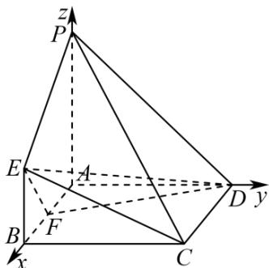

> [!faq]- 《第一章 空间向量与立体几何（高效培优讲义）》官方解析
>
> > [!success]- **【答案】** (1) $\frac{\sqrt{3}}{6}$ (2)存在，理由见解析
>
> > [!note]- **【解析】**
> > （1）因为 $PA \perp$ 平面 ABCD， $AB, AD \subset$ 平面 ABCD，且四边形 ABCD 为正方形，
> >
> > 所以 $AB, AD, AP$ 两两垂直，以 $AB, AD, AP$ 所在直线分别为 $x, y, z$ 轴建立如图所示的空间直角坐标系，
> >
> > 
> >
> > 由题意可得 $B(4,0,0)$ ， $C(4,4,0)$ ， $E(4,0,2)$ ， $P(0,0,4)$ ， $D(0,4,0)$
> >
> > 所以 $\overline{PC}=(4,4,-4)$ ， $\overline{PE}=(4,0,-2)$ ， $\overline{PD}=(0,4,-4)$
> >
> > 设平面 $PCE$ 的一个法向量为 $m = (x,y,z)$ ，则 $\left\{ \begin{array}{l} m \cdot PC = 4x + 4y - 4z = 0 \\ \rightarrow \square \square \\ m \cdot PE = 4x - 2z = 0 \end{array} \right.$
> >
> > 取 $x = 1$ 可得平面 $PCE$ 的一个法向量 $m = (1,1,2)$
> >
> > 设 PD 与平面 PCE 所成角为 $\alpha$
> >
> > $$
> > \sin \alpha = \left| \cos m, P D \right| = \frac {\left| m \cdot P D \right|}{\left| m \right| \left| P D \right|} = \frac {\left| 1 \times 0 + 1 \times 4 + 2 \times (- 4) \right|}{\sqrt {1 ^ {2} + 1 ^ {2} + 2 ^ {2}} \cdot \sqrt {0 ^ {2} + 4 ^ {2} + (- 4) ^ {2}}} = \frac {4}{\sqrt {6} \times 4 \sqrt {2}} = \frac {\sqrt {3}}{6}
> > $$
> >
> > 即 $PD$ 与平面 $PCE$ 所成角的正弦值为 $\frac{\sqrt{3}}{6}$ .
> >
> > (2) 依题意，可设 $F(a,0,0)$ ， $0 \leq a \leq 4$ ，则 $\overline{FE} = (4 - a,0,2)$ ， $\overline{DE} = (4, -4,2)$
> >
> > 设平面 $DEF$ 的一个法向量为 $n = (x_{1},y_{1},z_{1})$
> >
> > 则 $\left\{ \begin{array}{l} n \cdot DE = 4x_{1} - 4y_{1} + 2z_{1} = 0 \\ n \cdot FE = (4 - a)x_{1} + 2z_{1} = 0 \end{array} \right.$
> >
> > 取取 $x_{1} = 2$ 可得平面DEF的一个法向量 $\vec{n} = \left(2,\frac{a}{2},a - 4\right)$
> >
> > 若平面 $DEF \perp$ 平面 $PCE$ ，则 $m \cdot n = 1 \times 2 + 1 \times \frac{a}{2} + 2(a - 4) = 0$ ，
> >
> > 解得 $a=\frac{12}{5}$ ，即 $\frac{AF}{AB}=\frac{3}{5}$ ，
> >
> > 所以在棱 $AB$ 上存在一点 $F$ ，满足 $\frac{AF}{AB} = \frac{3}{5}$ 时，平面 $DEF \perp$ 平面 $PCE$ ：
