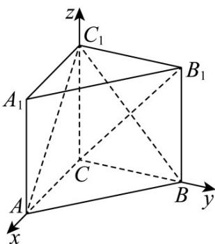

> [!faq]- 《第一章 空间向量与立体几何（高效培优讲义）》官方解析
>
> > [!success]- **【答案】** (1)存在 (2)存在，理由见解析
>
> > [!note]- **【解析】**
> > （1）因为 $AC = 3$ ， $BC = 4$ ， $AB = 5$ ，所以 $AC^2 + BC^2 = AB^2$ ，故 $AC \perp BC$
> >
> > 如图，以 $C$ 为坐标原点， $CA$ ， $CB$ ， $CC_{1}$ 分别为 $x$ 轴、 $y$ 轴、 $z$ 轴建立空间直角坐标系，
> >
> > 则 $C(0,0,0)$ ， $A(3,0,0)$ ， $B(0,4,0)$ ， $C_1(0,0,4)$
> >
> > 所以 $AB = (-3, 4, 0)$ ， $AC_{1} = (-3, 0, 4)$ ， $CA = (3, 0, 0)$
> >
> > 假设在 AB 上存在点 D 满足条件。
> >
> > 
> >
> > <!-- source-part:3 pages:101-103 -->
> >
> > $$
> > \text {设} \quad A D = \lambda A B (0 \leq \lambda \leq 1) \quad C D = C A + A D = C A + \lambda A B = (3 - 3 \lambda , 4 \lambda , 0)
> > $$
> >
> > 因为 $AC_{1} \perp CD$ ，所以 $AC_{1} \cdot CD = -9 + 9\lambda = 0$ ，解得 $\lambda = 1$ ，
> >
> > 即在 AB 上存在点 D 使得 $AC_{1} \perp CD$ ，此时点 D 与点 B 重合。
> >
> > (2) 假设在 $AB$ 上存在点 $E$ , 使得 $AC_{1} //$ 平面 $CEB_{1}$
> >
> > $$
> > A E = t A B (0 \leq t \leq 1) \quad C E = C A + A E = C A + t A B = (3 - 3 t, 4 t, 0) \quad C B _ {1} = (0, 4, 4)
> > $$
> >
> > 设平面 $CEB_{1}$ 的一个法向量 $n=(x,y,z)$
> >
> > 则有 $\left\{ \begin{array}{l} CB_{1} \cdot n = 0 \\ CE \cdot n = 0 \end{array} \right.$ ，得 $\left\{ \begin{array}{l} y + z = 0 \\ (3 - 3t)x + 4ty = 0 \end{array} \right.$ ，取 $y = 3t - 3$ ，可得 $n = (4t, 3t - 3, 3 - 3t)$ ，
> >
> > 由 $AC_{1}\cdot n = -3\times 4t + 4(3 - 3t) = 0$ ，解得 $t = \frac{1}{2}$
> >
> > 所以在 $AB$ 上存在点 $E$ ，使得 $AC_{1} / /$ 平面 $CEB_{1}$ ，这时 $E$ 为 $AB$ 的中点.
