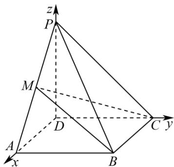

> [!faq]- 《第一章 空间向量与立体几何（高效培优讲义）》官方解析
>
> > [!success]- **【答案】** (1) $\frac{4}{5}$ (2) $\frac{3\sqrt{10}}{10}$
>
> > [!note]- **【解析】**
> > （1）因为 $PD \perp$ 平面 ABCD， $DA, DC \subset$ 平面 ABCD
> >
> > 所以 $PD \perp DA, PD \perp DC$
> >
> > 因为底面 ABCD 是矩形，所以 $DA \perp DC$ ，
> >
> > 所以 DA, DC, DP 两两垂直，
> >
> > 所以以 D 为原点，DA, DC, DP 分别为 x 轴、y 轴、z 轴，建立空间直角坐标系，如图，则 $A(2,0,0)$ ， $P(0,0,4)$ ， $C(0,4,0)$ ， $M(1,0,2)$ ， $B(2,4,0)$ 。
> >
> > 
> >
> > $$
> > \stackrel {{\square \sqcup \sqcup}} {A P} = (- 2, 0, 4) \quad \stackrel {{\square \sqcup \sqcup}} {C B} = (2, 0, 0) \quad \stackrel {{\square \sqcup \sqcup \sqcup}} {B M} = (- 1, - 4, 2)
> > $$
> >
> > 设平面 $CMB$ 的一个法向量 $n = (x,y,z)$ ，则有 $\left\{ \begin{array}{l} n \cdot CB_{x} = 2x = 0 \\ \rightarrow \square \square \square \\ n \cdot BM = -x - 4y + 2z = 0 \end{array} \right.$ ，
> >
> > 取 $y = 1$ ，得 $n = (0,1,2)$ ，设与平面 $CMB$ 所成角为 $\theta$ ，则 $\sin \theta = \frac{\left|\overrightarrow{AP} \cdot n\right|}{\left|AP\right|\left|n\right|} = \frac{8}{\sqrt{20} \times \sqrt{5}} = \frac{4}{5}$
> >
> > 所以 $_{AP}$ 与平面CMB所成角的正弦值为 $\frac{4}{5}$
> >
> > (2) 设平面 $PCB$ 的一个法向量为 $m = (a, b, c)$ , $PB = (2, 4, -4)$ ,
> >
> > 则有 $\left\{ \begin{array}{l} m \cdot CB = 2a = 0 \\ m \cdot PB = 2a + 4b - 4c = 0 \end{array} \right.$
> >
> > 取 $c = 1$ ，得 $m = (0,1,1)$ ， $\cos m,n = \frac{3}{\sqrt{5}\times\sqrt{2}} = \frac{3\sqrt{10}}{10}$
> >
> > 所以平面 $MCB$ 与平面 $PCB$ 夹角的余弦值为 $\frac{3\sqrt{10}}{10}$
