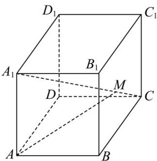

> [!faq]- 《第一章 空间向量与立体几何（高效培优讲义）》官方解析
>
> > [!success]- **【答案】** C
>
> > [!note]- **【解析】**
> > $A_{1}M = AM - AA_{1} = \frac{2}{3} AB + \frac{2}{3} AD + \frac{1}{3} AA_{1} - AA_{1} = \frac{2}{3} AB + \frac{2}{3} AD - \frac{2}{3} AA_{1}$ $= \frac{2}{3}(AB + AD - AA_{1}) = \frac{2}{3}(AC - AA_{1}) = \frac{2}{3} A_{1}C = \frac{2}{3}(A_{1}M + MC)$ 所以 $A_{1}M = 2MC$
> >
> > 故选：C.
> >
> > 
