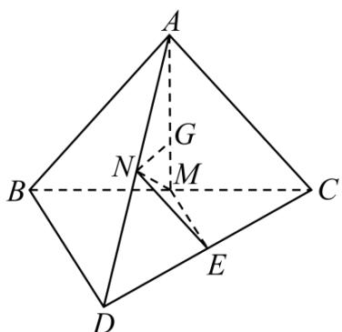

> [!faq]- 《第一章 空间向量与立体几何（高效培优讲义）》官方解析
>
> > [!success]- **【答案】** （1）（3）
>
> > [!note]- **【解析】**
> > 解：（1）∵ M 是线段 BC 的中点，∴ $\frac{\square\square\square\square}{NM} = \frac{1}{2}(NB + NC)$ ，正确；
> >
> > (2) 取 $CD$ 的中点 $E$ , 连接 $EN$ , $EM$ . 则 $\overline{NM} = NE + EM = \frac{1}{2} AC + \frac{1}{2} DB$ , 因此不正确;
> >
> > (3) $\overline{NG} = \overline{NM} + \overline{MG} = \overline{NM} + \frac{1}{3}\overline{MA} = \overline{NM} + \frac{1}{3}\left(\overline{NA} - \overline{NM}\right) = \frac{2}{3} \times \frac{1}{2}\left(\overline{NB} + \overline{NC}\right) + \frac{1}{3}\overline{NA} = \frac{1}{3}\left(\overline{NB} + \overline{NC} + \overline{NA}\right)$ ，因此
> >
> > 正确；
> >
> > (4) $\because M$ 、 $N$ 分别是线段 $BC$ 、 $AD$ 的中点， $\frac{uum}{AG} = \frac{2}{3} \frac{uur}{AM}$ ， $\therefore NG$ 与平面 $DBC$ 不平行，
> >
> > $\therefore$ 不存在实数 x，y，使得 $NG = xDB + yDC$
> >
> > 综上可得：只有（1）（3）正确。
> >
> > 故答案为：（1）（3）.
> >
> > 
