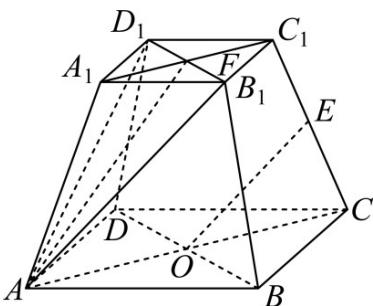

> [!faq]- 《第一章 空间向量与立体几何（高效培优讲义）》官方解析
>
> > [!success]- **【答案】** $\frac{3}{4} / 0.75$
>
> > [!note]- **【解析】**
> > 如图所示：
> >
> > 
> >
> > 连接 $A_{1}C_{1}$ ，设 $A_{1}C_{1}\cap B_{1}D_{1} = F$ ，平面 $A_{1}ACC_{1}\cap$ 平面 $AB_{1}D_{1} = AF$
> >
> > 因为 $OE \parallel$ 平面 $AB_{1}D_{1}$ ，且 $OE \subset$ 平面 $A_{1}ACC_{1}$
> >
> > 所以 OE//AF ;
> >
> > 因为四棱台底面为正方形，且 $AB = 3\sqrt{2}$ ， $A_{1}B_{1} = 2\sqrt{2}$
> >
> > 所以 $AC = 6$ ， $A_{1}C_{1} = 4$
> >
> > 从而
> >
> > $$
> > O E = O C + C E = \frac {1}{2} A C + \lambda C C _ {1}
> > $$
> >
> > 又因为 $AC = 6$ ， $A_{1}C_{1} = 4$
> >
> > 所以
> >
> > $$
> > A C + C _ {1} F = A C - \frac {1}{2} \times \frac {4}{6} A C = \frac {2}{3} A C
> > $$
> >
> > $$
> > A F = A C + C C _ {1} + C _ {1} F = \frac {2}{3} A C + C C _ {1}
> > $$
> >
> > 因为 $OE // AF$
> >
> > 所以 $\lambda=\frac{\lambda}{1}=\frac{\frac{1}{2}}{\frac{2}{3}}=\frac{3}{4}$
> >
> > 故答案为： $\frac{3}{4}$
