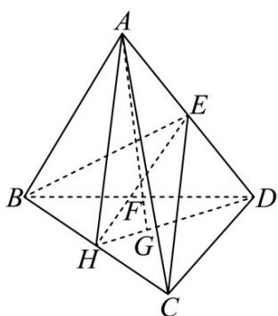

> [!faq]- 《第一章 空间向量与立体几何（高效培优讲义）》官方解析
>
> > [!success]- **【答案】** C
>
> > [!note]- **【解析】**
> > 如图：连接 DG 交 BC 于 H，则 H 为 BC 中点，连接 AH, EH, AG，
> >
> > 因为 $AG \subset$ 平面 $AHD$ ， $EH \subset$ 平面 $AHD$ ，设 $AG \cap EH = K$ ，则 $K \in EH, K \in AG$
> >
> > 又 $EH \subset$ 平面 $BCE$ ，所以 $K \in$ 平面 $BCE$ ，故 $K$ 为 $AG$ 与平面 $BCE$ 的交点，
> >
> > 又因为 AG 与平面 BCE 交于点 F，所以 F 与 K 重合，
> >
> > 又 E 为 AD 的中点，G 为平面 BCD 的重心，
> >
> > 因为点 A, F, G 三点共线，则
> >
> > $$
> > = m \left(\frac {\square \square \square}{A D} + \frac {2}{3} \times \frac {\square \square \square}{\frac {D B + D C}{2}}\right) = m \left[ \frac {\square \square \square}{A D} + \frac {1}{3} \times \left(\frac {\square \square \square}{A B - A D} + \frac {\square \square \square}{A C - A D}\right) \right] = \frac {1}{3} m \left(\frac {\square \square \square}{A D + A B + A C}\right)
> > $$
> >
> > 又因为点 $E, F, H$ 三点共线，则 $AF = xAH + yAE, (x + y = 1)$
> >
> > $\overline{AF}=xAH+yAE=\frac{x}{2}\left(AB+AC\right)+\frac{y}{2}AD,$
> >
> > 所以 $\left\{\begin{aligned}\frac{m}{3}&=\frac{x}{2}\\ x+y&=1\\ \frac{m}{3}&=\frac{y}{2}\end{aligned}\right.$ ，解得，即 $\frac{m}{3}=\frac{y}{2}$ $m=\frac{3}{4}$ $\frac{AF}{AF}=\frac{3}{4}AG$ ，故 $\frac{|AF|}{|AG|}=\frac{3}{4}$
> >
> > 故选：C.
> >
> > 
