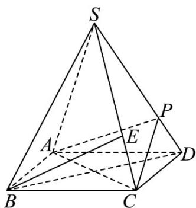

<!-- question-source:start -->
【变式1】如图所示，四棱锥 $S - ABCD$ 的底面是正方形，每条侧棱长都是底面边长的 $\sqrt{2}$ 倍， $P$ 为侧棱 $SD$ 上

的点，点 $E$ 为 $SC$ 上靠近点 $C$ 的三等分点.

(1)求证： $AC \perp SD$ ；

(2)若 $SD \perp$ 平面 PAC，证明： $BE \parallel$ 平面 PAC.
<!-- question-source:end -->

![[高中/课堂同步/题库/人教A版高中数学同步讲义(2026)/03_选择性必修第一册/第一章 空间向量与立体几何/第一章 空间向量与立体几何（高效培优讲义）/题型05_空间向量在立体几何平行_垂直问题中的应用/questions/answers/Q00079984A1.md]]
