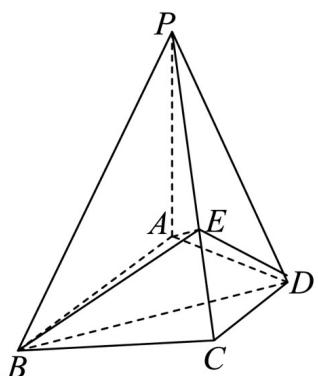

<!-- question-source:start -->
【变式2】如图，在四棱锥 $P - ABCD$ 中， $PA \perp$ 底面 $ABCD$ ， $AB \parallel DC$ ， $DA \perp AB$ ， $AB = AP = 2$

$DA = DC = 1$ ， $E$ 为 $PC$ 上一点，且 $PE = \frac{2}{3} PC$ （请用空间向量法予以证明）

(1)求证： $AE\perp$ 平面 $PBC$

(2)求证： $PA \parallel$ 平面 BDE .
<!-- question-source:end -->

![[高中/课堂同步/题库/人教A版高中数学同步讲义(2026)/03_选择性必修第一册/第一章 空间向量与立体几何/第一章 空间向量与立体几何（高效培优讲义）/题型05_空间向量在立体几何平行_垂直问题中的应用/questions/answers/Q00079985A1.md]]
