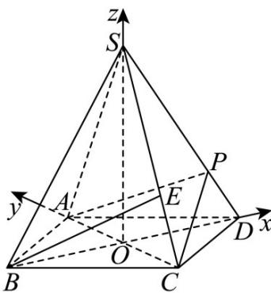

> [!faq]- 《第一章 空间向量与立体几何（高效培优讲义）》官方解析
>
> > [!success]- **【答案】** (1)证明见解析 (2)证明见解析
>
> > [!note]- **【解析】**
> > （1）如图，连接BD交AC于点O，连接SO
> >
> > 
> >
> > 根据题意可知该四棱锥为正四棱锥，∴ $SO \perp$ 平面 ABCD ，∵ $AC \subset$ 平面 ABCD ，∴ $SO \perp AC$
> >
> > 又四边形 ABCD 为正方形，∴ $AC \perp BD$ .
> >
> > 又 $SO \cap BD = O$ ， $SO \subset$ 平面 $SBD$ ， $BD \subset$ 平面 $SBD$ ， $\therefore AC \perp$ 平面 $SBD$
> >
> > ∵ $SD \subset$ 平面 SBD ∴ AC ⊥ SD
> >
> > (2) 以 O 为坐标原点，分别以 OD，OA，OS 所在的直线为 x, y, z 轴，建立如图所示的空间直角坐标系，令
> >
> > $OC = 1$ ，则 $BC = \sqrt{2}$ ， $SC = 2$ ， $SO = \sqrt{3}$
> >
> > $$
> > \therefore D (1, 0, 0), B (- 1, 0, 0), C (0, - 1, 0), S (0, 0, \sqrt {3}), E \left(0, - \frac {2}{3}, \frac {\sqrt {3}}{3}\right)
> > $$
> >
> > $\therefore \overrightarrow{BE} = \left(1, -\frac{2}{3}, \frac{\sqrt{3}}{3}\right)$ ， $\overrightarrow{DS} = (-1, 0, \sqrt{3})$ ，由 $SD \perp$ 平面 $PAC$ ，知 $\overrightarrow{DS}$ 为平面 $PAC$ 的一个法向量。
> >
> > 又 $BE \cdot DS = -1 + 1 = 0$ ，且 $BE$ 不在平面 $PAC$ ， $\therefore BE //$ 平面 $PAC$ 。
