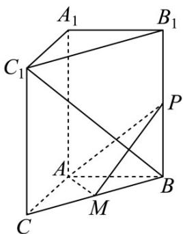
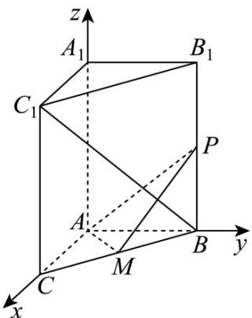

> [!faq]- 《第一章 空间向量与立体几何（高效培优讲义）》官方解析
>
> > [!success]- **【答案】** BC 的中点，P 为侧棱 $BB_{1}$ 上的动点.  (1)求证：平面 $AMP \perp$ 平面 $BB_{1}C_{1}C$ ； (2)试判断是否存在 $P$ ，使得直线 $BC_{1} \perp AP$ . 若存在，求 $PB$ 的长；若不存在，请说明理由.
>
> > [!note]- **【解析】**
> > （1）∵ 在三棱柱 $ABC-A_{1}B_{1}C_{1}$ 中， $BB_{1}\perp$ 底面 ABC， $AM\subset$ 平面 ABC，
> > ∴ $AM \perp BB_{1}$
> >
> > ∵ AB = AC = 2，M 为 BC 的中点，
> >
> > $\therefore AM \perp BC$
> >
> > $\therefore BC\cap BB_{1}=B,\quad BC,BB_{1}\subset\quad B B_{1}C_{1}C$ 平面
> >
> > $\therefore AM \perp_{\text{平面}} BB_{1}C_{1}C$
> >
> > ∵ $AM \subset_{平面} APM$
> >
> > ∴ 平面 $APM \perp$ 平面 $BB_{1}C_{1}C$
> >
> > (2) 以 A 为原点，AC 为 x 轴，AB 为 y 轴， $AA_{1}$ 为 z 轴，建立空间直角坐标系，如图所示，
> >
> > 
> >
> > $B(0,2,0)$ $C_1(2,0,3)$ $A(0,0,0)$
> >
> > 设 $BP = t(0 \leq t \leq 3)$ ，则 $P(0,2,t)$ ， $BC_1 = (2, -2,3)$ ， $AP = (0,2,t)$
> >
> > 若 $BC_{1} \perp AP$ ，则 $\overline{BC_1} \cdot \overline{AP} = 0 - 4 + 3t = 0$ ，解得 $t = \frac{4}{3} < 3$
> >
> > 所以存在 P，使得直线 $BC_{1} \perp AP$ ，此时 $PB = \frac{4}{3}$ .
