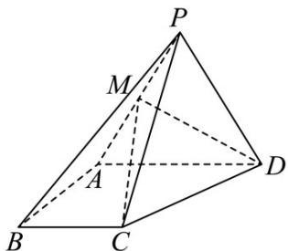

<!-- question-source:start -->
【变式1】如图，在四棱锥 $P - ABCD$ 中，平面 $PAD \perp$ 平面 $ABCD$ ， $\triangle PAD$ 为等边三角形， $PD \perp AB$

$AD // BC$ ，AD = 4，AB = BC = 2，M 为 PA 的中点.

(1)证明： $DM\perp$ 平面 $PAB$ ；

(2)求直线 PB 与平面 MCD 所成角的正弦值.
<!-- question-source:end -->

![[高中/课堂同步/题库/人教A版高中数学同步讲义(2026)/03_选择性必修第一册/第一章 空间向量与立体几何/第一章 空间向量与立体几何（高效培优讲义）/题型06_空间角的计算/questions/answers/Q00079989A1.md]]
