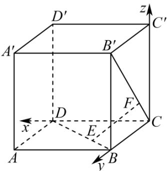

> [!faq]- 《第一章 空间向量与立体几何（高效培优讲义）》官方解析
>
> > [!success]- **【答案】** (1)证明见解析 (2)证明见解析 $$ \sqrt {7} $$ (3) 14
>
> > [!note]- **【解析】**
> > （1）设正方体的棱长为3，以 $CD$ ， $CB$ ， $CC'$ 分别为 $x$ 轴、 $y$ 轴、 $z$ 轴正方向建立如图所示空间直
> >
> > 角坐标系，
> >
> > 
> >
> > 则由题意可得 $E(1,2,0)$ ， $F(0,1,1)$ ， $A(3,3,0)$ ， $C'(0,0,3)$
> >
> > 所以 $EF = (-1, -1, 1)$ ， $AC' = (-3, -3, 3)$
> >
> > 所以 $AC' = 3EF$ ，即 $EF \parallel AC'$
> >
> > (2) 由 (1) 得 $B(0,3,0)$ , $D(3,0,0)$ , $B'(0,3,3)$ , $EF = (-1,-1,1)$ ,
> >
> > 所以 $\overset{\square\square\square\square}{BD}=\left(3,-3,0\right)$ $\overset{\square\square\square\square\square}{B^{\prime}C}=\left(0,-3,-3\right)$
> >
> > 所以 $BD \cdot EF = 3 \times (-1) + (-3) \times (-1) + 0 \times 1 = 0$
> >
> > $$
> > E F \cdot B ^ {\prime} C = 0 \times (- 1) + (- 3) \times (- 1) + (- 3) \times 1 = 0
> > $$
> >
> > 所以 $EF \perp BD$ ， $EF \perp B'C$
> >
> > (3) 由 (1) (2) 得 $\overline{FA} = (3, 2, -1)$ , $\overline{BD} = (3, -3, 0)$
> >
> > 所以 $FA \cdot BD = 3 \times 3 + 2 \times (-3) + (-1) \times 0 = 3$
> >
> > $$
> > \left| \stackrel {\text {WWW}} {F A} \right| = \sqrt {3 ^ {2} + 2 ^ {2} + (- 1) ^ {2}} = \sqrt {1 4}, \left| \stackrel {\text {WWW}} {B D} \right| = \sqrt {3 ^ {2} + (- 3) ^ {2} + 0 ^ {2}} = 3 \sqrt {2}
> > $$
> >
> > 设 FA 与 BD 所成角为 $\theta$ ，
> >
> > 则 $\cos\theta=\left|\frac{\square\square\square\cdot\square\square\square}{\left|\begin{matrix}F4\cdot BD\\ FA\end{matrix}\right|}\right|=\frac{3}{3\sqrt{2}\times\sqrt{14}}=\frac{\sqrt{7}}{14}$
