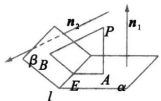

> [!faq]- 《第一章 空间向量与立体几何（高效培优讲义）》官方解析
>
> > [!success]- **【答案】** 详见解析
>
> > [!note]- **【解析】**
> > （1）因为 $\angle BCD = 90^{\circ}$ ，所以 $BC \perp CD$ ，
> >
> > 又平面 $ABC \perp$ 平面 BCD ，交线为 BC ， $CD \subset$ 平面 BCD ，所以 $CD \perp$ 平面 ABC ，
> >
> > 又 $BC, AC \subset$ 平面 $ABC$ ，所以 $CD_{\perp}BC$ ， $CD_{\perp}AC$
> >
> > 以 C 为原点、 CD 为 x 轴、 CB 为 y 轴、平面 ABC 上过点 C 的 BC 的垂线为 z 轴建立空间直角坐标系，如图， $\triangle BAC$ 与 $\triangle BCD$ 均为等腰直角三角形，BC=2，则 $C(0,0,0)$ ， $A(0,1,1)$ ， $D(2,0,0)$
> >
> > 平面 $BCD$ 的法向量为 $m = (0,0,1)$
> >
> > 设 $AD$ 与平面 $BCD$ 所成的角为 $\theta$ ， $\overline{DA} = (-2,1,1)$
> >
> > $$
> > \sin \theta = \frac {\left| \overrightarrow {D A} \cdot m \right|}{\left| \overrightarrow {D A} \right| \cdot | m |} = \frac {\left| (- 2 , 1 , 1) \cdot (0 , 0 , 1) \right|}{\sqrt {4 + 1 + 1}} = \frac {\sqrt {6}}{6},
> > $$
> >
> > 故 $\cos \theta = \sqrt{1 - \sin^2\theta} = \frac{\sqrt{30}}{6}$
> >
> > 
> >
> > (2) $B(0,2,0)$ ，设 $Q(\mu,0,0)$ ， $0 < \mu < 2$ 。设 $AP = \lambda AB = (0,\lambda, -\lambda)$ ，其中 $0 < \lambda \leq 1$ ，
> >
> > 但当 $\lambda = 0$ 时， $A, P$ 两点重合，此时 $PQ$ 与 $AC$ 不是异面直线，故 $\lambda \neq 0$ ，所以 $0 < \lambda \leq 1$
> >
> > 则 $PQ = CQ - CP = CQ - (CA + AP) = (\mu, -1 - \lambda, \lambda - 1)$
> >
> > 由 $\cos30^{\circ}=\frac{\left|\begin{matrix}\square\square\square\\CA\cdot PQ\\ \square\square\square\end{matrix}\right|}{\left|\begin{matrix}CA\end{matrix}\right|\left|\begin{matrix}PQ\end{matrix}\right|}=\frac{2}{\sqrt{2}\times\sqrt{\mu^{2}+2\lambda^{2}+2}}=\frac{\sqrt{3}}{2}$ ，得 $\mu^{2}+2\lambda^{2}+2=\frac{8}{3}$ ，
> >
> > 其中 $0 < \mu < 2$ ，即 $\frac{2}{3} - 2\lambda^2 \in (0,4)$ ，解得 $\lambda^2 \in \left[0, \frac{1}{3}\right)$
> >
> > 又 $0 < \lambda \leq 1$ ，所以 $\lambda \in \left(0, \frac{\sqrt{3}}{3}\right)$
> >
> > 故 $\left|\overrightarrow{AP}\right| = \sqrt{2}\lambda \in \left(0,\frac{\sqrt{6}}{3}\right)$
> >
> > ## 方法技巧
> >
> > 异面直线所成的角：已知 $a, b$ 为两异面直线， $A, C$ 与 $B, D$ 分别是 $a, b$ 上的任意两点， $a, b$ 所成的角为 $\theta$
> >
> > 则 $\cos \theta = \frac{\left|\overline{AC} \cdot \overline{BD}\right|}{\left|AC\right| \cdot \left|BD\right|}$
> >
> > 线面角：设直线 $l$ 的方向向量为 $a$ ，平面 $\alpha$ 的法向量为 $u$ ，直线与平面所成的角为 $\theta$ ， $a$ 与 $u$ 的角为 $\varphi$ ，则有
> >
> > $$
> > \sin \theta = | \cos \varphi | = \frac {| \underset {\rightarrow} {a} \cdot u |}{| a | \cdot | u |}
> > $$
> >
> > 二面角：如图，若 $PA \perp \alpha$ 于 $A, PB \perp \beta$ 于 $B$ ，平面 $PAB$ 交 $l$ 于 $E$ ，则 $\angle AEB$ 为二面角 $\alpha - l - \beta$ 的平面角， $\angle AEB + \angle APB = 180^{\circ}$
> >
> > 
> >
> > 若 $n_1, n_2$ 分别为面 $\alpha, \beta$ 的法向量， $\cos \left\langle n_1, n_2 \right\rangle = \frac{n_1 \cdot n_2}{|n_1| \cdot |n_2|}$ 则二面角的平面角 $\angle AEB = \left\langle n_1, n_2 \right\rangle$ 或 $\pi - \left\langle n_1, n_2 \right\rangle$
