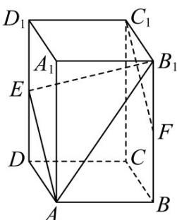

<!-- question-source:start -->
【变式1】如图，在长方体 $ABCD - A_{1}B_{1}C_{1}D_{1}$ 中， $A_{1}A = 2AB = 2BC = 2$ ， $E$ 为棱 $DD_{1}$ 的中点， $F$ 为棱 $BB_{1}$ 的中

点.

(1)证明 $FC_{1} / / AE$ ，并求直线 $FC_{1}$ 到直线 $AE$ 的距离；

(2)求点 $A_{1}$ 到平面 $AB_{1}E$ 的距离.
<!-- question-source:end -->

![[高中/课堂同步/题库/人教A版高中数学同步讲义(2026)/03_选择性必修第一册/第一章 空间向量与立体几何/第一章 空间向量与立体几何（高效培优讲义）/题型07_空间距离的计算/questions/answers/Q00079994A1.md]]
