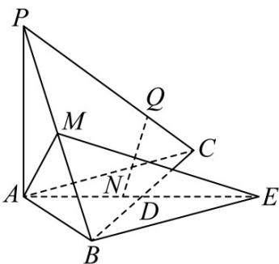

<!-- question-source:start -->
【变式2】如图，在三棱锥 $P - ABC$ 中， $AP \perp$ 平面 $ABC$ ， $D$ ， $M$ 分别是 $BC$ ， $PB$ 的中点， $AP = AC = 2$ ，

$AB = 2\sqrt{2}$ ， $AD = \sqrt{3}$ 延长 $AD$ 至点 E，使得 AE = 2AD，连接 ME

(1)证明： $ME \perp BC$ ；

(2)求二面角 $B - AM - E$ 的余弦值；

(3)若点 N，Q 分别是直线 AE，PC 上的动点，求 NQ 的最小值.
<!-- question-source:end -->

![[高中/课堂同步/题库/人教A版高中数学同步讲义(2026)/03_选择性必修第一册/第一章 空间向量与立体几何/第一章 空间向量与立体几何（高效培优讲义）/题型07_空间距离的计算/questions/answers/Q00079995A1.md]]
