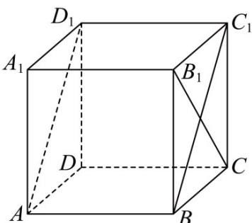

<!-- question-source:start -->
【变式3】在棱长为2的正方体 $ABCD - A_{1}B_{1}C_{1}D_{1}$ 中，求

(1)直线 $BC$ 与平面 $ABC_{1}D_{1}$ 所成的角；

(2)求平面 $A_{1}BD$ 与平面 $B_{1}D_{1}C$ 的距离；

(3)求三棱锥 $B_{1} - A_{1}BD$ 外接球的表面积；
<!-- question-source:end -->

![[高中/课堂同步/题库/人教A版高中数学同步讲义(2026)/03_选择性必修第一册/第一章 空间向量与立体几何/第一章 空间向量与立体几何（高效培优讲义）/题型07_空间距离的计算/questions/answers/Q00079996A1.md]]
