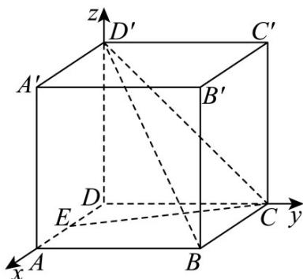

> [!faq]- 《第一章 空间向量与立体几何（高效培优讲义）》官方解析
>
> > [!success]- **【答案】** (1) $\frac{\sqrt{5}}{5}$ (2) $\sqrt{2}$
>
> > [!note]- **【解析】**
> > （1）以 $D$ 为原点，分别以 $DA, DC, DD'$ 所在直线为 $x, y, z$ 轴，建立如图所示的空间直角坐标系，则 $C(0,2,0)$ $E(1,0,0)$ $B'(2,2,2)$ $C'(0,2,2)$
> >
> > 
> >
> > 所以 $\overrightarrow{CE} = (1, -2, 0)$ ， $\overrightarrow{B'C'} = (-2, 0, 0)$ ，所以 $\left|\cos\left\langle\overrightarrow{CE}, B'C'\right\rangle\right| = \frac{\left|\overrightarrow{CE} \cdot B'C'\right|}{\left|CE\right| \cdot \left|B'C'\right|} = \frac{2}{\sqrt{5} \times 2} = \frac{\sqrt{5}}{5}$
> >
> > 即直线 CE 与直线 $B^{\prime}C^{\prime}$ 所成角的余弦值为 $\frac{\sqrt{5}}{5}$ .
> >
> > (2) 由于 $B^{\prime}C^{\prime}\parallel BC$ ， $BC \subset \text{平面 } BCD^{\prime}$ ， $B^{\prime}C^{\prime} \notin \text{平面 } BCD^{\prime}$ ，故 $B^{\prime}C^{\prime} // \text{平面 } BCD^{\prime}$
> >
> > 因此直线 $B^{\prime}C^{\prime}$ 到平面 $BCD^{\prime}$ 的距离与点 $B^{\prime}$ 到平面 $BCD^{\prime}$ 的距离相等.
> >
> > $D^{\prime}(0,0,2)$ $B(2,2,0)$ $\overline{BC} = \overline{B'C'} = (-2,0,0)$ $\overline{BD'} = (-2,-2,2)$
> >
> > 设平面 $BCD'$ 的法向量为 $m = (x, y, z)$ ，则 $m \cdot BC = -2x = 0$ ，且 $m \cdot BD' = -2x - 2y + 2z = 0$ ，
> >
> > 令 $y = 1$ ，则 $m = (0,1,1)$ .
> >
> > 又 $BB' = (0, 0, 2)$ ，故 $B'$ 到平面 $BCD'$ 的距离为 $\frac{\left|\overrightarrow{BB'} \cdot m\right|}{\left|m\right|} = \frac{2}{\sqrt{2}} = \sqrt{2}$
> >
> > 因此直线 $B^{\prime}C^{\prime}$ 到平面 $BCD^{\prime}$ 的距离为 $\sqrt{2}$ .
