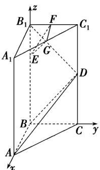

> [!faq]- 《第一章 空间向量与立体几何（高效培优讲义）》官方解析
>
> > [!success]- **【答案】** (1)证明见解析； (2)证明见解析； $$ 3 \sqrt {2} $$ (3) 2.
>
> > [!note]- **【解析】**
> > （1）由题设， $BA,BC,BB_{1}$ 两两互相垂直，
> >
> > 以 $B$ 为坐标原点， $BA, BC, BB_{1}$ 分别为 $x$ 轴、 $y$ 轴、 $z$ 轴建立空间直角坐标系，如图所示，
> >
> > 
> >
> > 则 $B(0,0,0)$ , $D(0,2,2)$ , $B_{1}(0,0,4)$ ，设 BA = a，则 $A(a,0,0)$ .
> >
> > 所以 $\overline{BA}=(a,0,0),\overline{BD}=(0,2,2),\overline{B_{1}D}=(0,2,-2)$ ，易得 $\overline{B_{1}D}\cdot\overline{BA}=0,\quad\overline{B_{1}D}\cdot\overline{BD}=0$
> >
> > 所以 $\stackrel{\square\square\square\square}{B_{1}D}\perp\stackrel{\square\square\square}{BA},\quad\stackrel{\square\square\square\square}{B_{1}D}\perp\stackrel{\square\square\square}{BD}$ ，所以 $B_{1}D\perp BA,\quad B_{1}D\perp BD$
> >
> > 又 $BA \cap BD = B$ ，且 $BA, BD$ 都在平面 $ABD$ 内，故 $B_{1}D \perp$ 平面 $ABD$ .
> >
> > (2) 由题意知 $E(0,0,3), G(\frac{a}{2},1,4), F(0,1,4)$ ，则 $EG = (\frac{a}{2},1,1), EF = (0,1,1)$
> >
> > 所以 $B_{1}D \cdot EG = 0$ ， $B_{1}D \cdot EF = 0$ ，则 $B_{1}D \perp EG$ ， $B_{1}D \perp EF$
> >
> > 所以 $B_{1}D \perp EG$ ， $B_{1}D \perp EF$
> >
> > 又 $EG \cap EF = E$ 且 $B_{1}D, EF$ 都在平面 $EFG$ 内，所以 $B_{1}D \perp$ 平面 $EFG$
> >
> > 结合（1）知，平面 $EGF / /$ 平面ABD.
> >
> > (3) 由 (1) (2) 知， $\overline{BF}=(0,1,4)$ ， $\overline{B_{1}D}=(0,2,-2)$ 是平面 ABD 的法向量，
> >
> > 所以点 $F$ 到平面 $ABD$ 的距离为 $d = \frac{\left|\overrightarrow{BF} \cdot \overrightarrow{B_1 D}\right|}{\left|\overrightarrow{B_1 D}\right|} = \frac{6}{\sqrt{8}} = \frac{3\sqrt{2}}{2}$
> >
> > 由（2）知，平面 $EGF$ 与平面 $ABD$ 的距离等于点 $F$ 到平面 $ABD$ 的距离，
> >
> > 所以两平面间的距离为 $\frac{3\sqrt{2}}{2}$ .
> >
> > ## 方法技巧
> >
> > 1. 求点面距的一般步骤：
> > - **①**：求出该平面的一个法向量；
> > - **②**：找出从该点出发的平面的任一条斜线段对应的向量；
> > - **③**：求出法向量与斜线段向量的数量积的绝对值再除以法向量的模，即可求出点到平面的距离。
> >
> > 即：点 $A$ 到平面 $\alpha$ 的距离 $d = \frac{\left|AB\cdot n\right|}{|n|}$ ，其中 $B \in \alpha$ ， $n$ 是平面 $\alpha$ 的法向量。
> >
> > 2. 设直线 $l$ 的单位方向向量为 $u, A \in l, P \notin l$ , 设 $AP = a$ , 则点 $P$ 到直线 $l$ 的距离 $d = \sqrt{\left|a\right|^2 - (a \cdot u)^2}$
