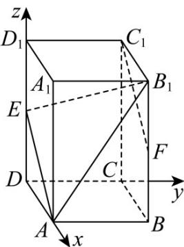

> [!faq]- 《第一章 空间向量与立体几何（高效培优讲义）》官方解析
>
> > [!success]- **【答案】** (1)证明见解析， $\frac{\sqrt{6}}{2}$ (2) $\frac{\sqrt{6}}{3}$
>
> > [!note]- **【解析】**
> > （1）以 $D$ 为坐标原点，分别以 $DA, DC, DD_{1}$ 所在直线为 $x$ 轴、 $y$ 轴、 $z$ 轴建立如图所示的空间直角
> >
> > 坐标系，
> >
> > 则 $A(1,0,0)$ ， $E(0,0,1)$ ， $A_{1}(1,0,2)$ ， $C_1(0,1,2)$ ， $B_{1}(1,1,2)$ ， $F(1,1,1)$
> >
> > 
> >
> > 由上可知， $FC_{1}=\left(-1,0,1\right)$ ， $AE=\left(-1,0,1\right)$ ，故 $FC_{1}//AE$ ，故 $FC_{1}//AE$
> >
> > $EF = (1,1,0)$ ，设直线 $FC_{1}$ 到直线 AE 的距离为 d，则 d 即为 F 到直线 AE 的距离，
> >
> > 又 $\left|\overline{EF}\right|=\sqrt{2}$ ， $\left|\overline{AE}\right|=\sqrt{2}$ ， $AE\cdot EF=-1$
> >
> > $$
> > \therefore d = \sqrt {\left| \frac {\square \square \vec {E F}}{A E} \right| ^ {2} - \left(\frac {\square \square \vec {E F}}{\left| A E \right|}\right) ^ {2}} = \sqrt {2 - \left(\frac {- 1}{\sqrt {2}}\right) ^ {2}} = \frac {\sqrt {6}}{2},
> > $$
> >
> > 则直线 $FC_{1}$ 到直线 $AE$ 的距离为 $\frac{\sqrt{6}}{2}$
> >
> > (2) 设平面 $AB_{1}E$ 的法向量为 $n = (x, y, z)$
> >
> > 由（1）可知， $B_{1}E=\left(-1,-1,-1\right)$ ， $A_{1}B_{1}=\left(0,1,0\right)$
> >
> > 则 $\left\{\begin{aligned}n\cdot AE&=0,\\ \rightarrow\square\square\square\\ n\cdot B_{1}E&=0,\end{aligned}\right.$ 即 $\left\{\begin{aligned}-x+z&=0,\\ -x-y-z&=0,\end{aligned}\right.$
> >
> > 令 $x = 1$ ，则 $y = -2, z = 1$ ，所以 $n = (1, -2, 1)$
> >
> > 设点 $A_{1}$ 到平面 $AB_{1}E$ 的距离为 $d_{1}$
> >
> > $$
> > \therefore d _ {1} = \frac {\left| A _ {1} B _ {1} \cdot n \right|}{\left| n \right|} = \frac {\left| 0 \times 1 + 1 \times (- 2) + 0 \times 1 \right|}{\sqrt {1 + 4 + 1}} = \frac {\sqrt {6}}{3},
> > $$
> >
> > 则点 $A_{1}$ 到平面 $AB_{1}E$ 的距离为 $\frac{\sqrt{6}}{3}$
