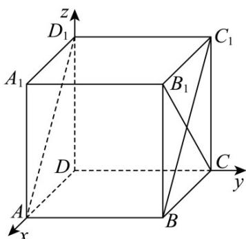
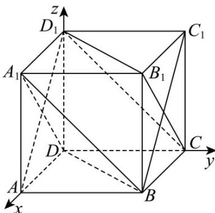

> [!faq]- 《第一章 空间向量与立体几何（高效培优讲义）》官方解析
>
> > [!success]- **【答案】** (1) $45^{\circ}$ $$ 2 \sqrt {3} $$ (2) 3 (3) $12\pi$
>
> > [!note]- **【解析】**
> > （1）
> >
> > 
> >
> > 建立如图所示，以 $D$ 为坐标原点，
> >
> > $DA$ 、 $DC$ 、 $DD_{1}$ 分别为 x 轴、 y 轴、 z 轴的空间直角坐标系，
> >
> > 根据题意有： $A(2,0,0)$ ， $B(2,2,0)$ ， $C(0,2,0)$ ， $C_1(0,2,2)$ ， $D_{1}(0,0,2)$
> >
> > 所以 $\overline{BC} = (-2,0,0)$ ， $\overline{AB} = (0,2,0)$ ， $\overline{AD}_{1} = (-2,0,2)$
> >
> > 设平面 $ABC_{1}D_{1}$ 的法向量为 $n_{1}^{\square}=\left(x_{1},y_{1},z_{1}\right)$
> >
> > 所以 $\left\{\begin{aligned}\overline{n_{1}}&\cdot AB=0\\ \overline{n_{1}}&\cdot AD_{1}=0\end{aligned}\right.$ ，即 $\left\{\begin{aligned}2y_{1}&=0\\ -2x_{1}&+2z_{1}=0\end{aligned}\right.$ ，令 $x_{1}=1$ ，则有 $\left\{\begin{aligned}x_{1}&=1\\ y_{1}&=0\\ z_{1}&=1\end{aligned}\right.$ ，
> >
> > 所以 $\stackrel{\square}{n}_{1}=(1,0,1)$ 为平面 $ABC_{1}D_{1}$ 的一个法向量，
> >
> > 设直线 BC 与平面 $ABC_{1}D_{1}$ 所成角为 $\theta$ ，
> >
> > 则有 $\sin\theta=\frac{\left|\overrightarrow{BC}\cdot\overrightarrow{n_{1}}\right|}{\left|\overrightarrow{BC}\right|\left|n_{1}\right|}=\frac{\left|-2\times1+0+0\right|}{2\sqrt{2}}=\frac{\sqrt{2}}{2}$ ，又因为 $\theta\in\left[0,90^{\circ}\right]$
> >
> > 所以 $\theta = 45^{\circ}$
> >
> > (2)
> >
> > 
> >
> > 连接 $A_{1}D$ 、 $A_{1}B$ 、BD、 $B_{1}D_{1}$ 、 $B_{1}C$ 、 $CD_{1}$ ，
> >
> > 因为 $DD_{1}//BB_{1}$ ， $DD_{1}=BB_{1}$ ，所以四边形 $DBB_{1}D_{1}$ 是平行四边形，
> >
> > 所以 $BD//B_{1}D_{1}$ ，又因为 $BD\not\subset$ 平面 $B_{1}D_{1}C$ ， $B_{1}D_{1}\subset$ 平面 $B_{1}D_{1}C$
> >
> > 所以 $BD / /$ 平面 $B_{1}D_{1}C$ ；同理可证 $A_{1}B / /$ 平面 $B_{1}D_{1}C$
> >
> > 又 $BD \cap A_{1}B = B$ ， $BD, A_{1}B \subset$ 平面 $A_{1}BD$
> >
> > 所以平面 $A_{1}BD \parallel$ 平面 $B_{1}D_{1}C$ ;
> >
> > 因为 $D_{1}(0,0,2)$ ， $B(2,2,0)$ ， $A_{1}(2,0,2)$ ， $D(0,0,0)$
> >
> > 所以 $\overline{DB}=(2,2,0)$ ， $\overline{D_{1}A_{1}}=(2,0,0)$ ， $\overline{DA_{1}}=(2,0,2)$
> >
> > 设平面 $A_{1}BD$ 的法向量为 $n=(x,y,z)$ ,
> >
> > 则 $\left\{ \begin{array}{l} n \cdot DB = 0 \\ \rightarrow \square \square \square \\ n \cdot DA_{1} = 0 \end{array} \right.$ ， $\left\{ \begin{array}{l} 2x + 2y = 0 \\ 2x + 2z = 0 \end{array} \right.$
> >
> > 令 x=1 ，可得 y=-1, z=-1
> >
> > 则 $n=(1,-1,-1)$ 为平面 $A_{1}BD$ 的一个法向量，
> >
> > 所以平面 $A_{1}BD$ 与平面 $B_{1}D_{1}C$ 的距离 $d=\frac{\left|\overrightarrow{D_{1}A_{1}}\cdot n\right|}{\left|n\right|}=\frac{2}{\sqrt{3}}=\frac{2\sqrt{3}}{3}$
> >
> > (3) 根据补形法可知三棱锥 $B_{1} - A_{1}BD$ 的外接球就是正方体 $ABCD - A_{1}B_{1}C_{1}D_{1}$ 的外接球，
> >
> > 设三棱锥 $B_{1} - A_{1}BD$ 的外接球半径为 $R$ ，则 $2R = \sqrt{2^2 + 2^2 + 2^2} = 2\sqrt{3}$
> >
> > 所以 $R = \sqrt{3}$ ，所以三棱锥 $B_{1} - A_{1}BD$ 的外接球的表面积为 $S = 4\pi R^2 = 12\pi$
