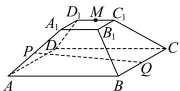

<!-- question-source:start -->
【典例1】如图，正四棱台 $ABCD - A_{1}B_{1}C_{1}D_{1}$ 中， $AB = 3$ ， $A_{1}B_{1} = 1$ ， $AA_{1} = 2$ ， $M$ 是 $C_1D_1$ 的中点，在直线

$AA_{1}, BC$ 上各取一个点 $^{P}$ ， $Q$ ，使得 $M, P, Q$ 三点共线，则线段 $^{PQ}$ 的长度为（）

A.3 B. $\sqrt{15}$ C. $\frac{27}{5}$ D.4

##
<!-- question-source:end -->

![[高中/课堂同步/题库/人教A版高中数学同步讲义(2026)/03_选择性必修第一册/第一章 空间向量与立体几何/第一章 空间向量与立体几何（高效培优讲义）/题型08_空间向量与立体几何的综合问题/questions/answers/Q00079997A1.md]]
